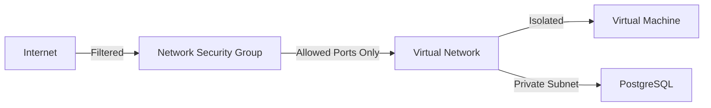

# The Things Stack on Azure

[](https://azure.microsoft.com)
[](https://www.thethingsindustries.com/stack/)
[](https://www.docker.com/)
[](https://www.postgresql.org/)
[](LICENSE)

> **Production-ready deployment solution for The Things Stack (LoRaWAN Network Server) on Microsoft Azure**  
> Automated infrastructure provisioning with security hardening, monitoring, and operational best practices built-in.

---

## 📑 Table of Contents

- [🎯 Overview](#-overview)
- [🚀 Quick Start](#-quick-start)
- [🏗️ Architecture](#️-architecture)
- [🔧 Deployment Options](#-deployment-options)
- [📦 What Gets Deployed](#-what-gets-deployed)
- [🛡️ Security Features](#️-security-features)
- [🎉 Post-Deployment](#-post-deployment)
- [📊 Operations Guide](#-operations-guide)
- [📈 Monitoring & Alerts](#-monitoring--alerts)
- [💰 Cost Estimation](#-cost-estimation)
- [🐛 Troubleshooting](#-troubleshooting)
- [📚 Documentation](#-documentation)
- [🤝 Contributing](#-contributing)
- [🆘 Support](#-support)
- [⚖️ License](#️-license)
- [⚠️ Important Notices](#️-important-notices)
- [🎯 Quick Reference Card](#-quick-reference-card)

---

## 🎯 Overview

This repository provides **Infrastructure as Code (IaC)** for deploying [The Things Stack](https://www.thethingsindustries.com/stack/) on Azure. The deployment is fully automated, production-ready, and includes:

✅ **Automated provisioning** - One-command deployment via PowerShell or Bash  
✅ **Security hardening** - SSH IP restriction, private database access, Key Vault integration  
✅ **TLS/SSL automation** - Let's Encrypt certificates with auto-renewal  
✅ **High availability ready** - Scalable architecture with migration path to AKS  
✅ **Monitoring built-in** - Azure Monitor, Log Analytics, Application Insights  
✅ **Cost optimized** - ~$205/month for production-grade deployment  

### Use Cases

- **Private LoRaWAN Network**: Deploy your own network server for complete data ownership
- **Development/Testing**: Rapid environment provisioning for testing devices and gateways
- **Production IoT**: Enterprise-grade LoRaWAN infrastructure with Azure backing
- **Multi-Region Deployments**: Blueprint for global LoRaWAN coverage

### Key Capabilities

| Feature | Description |
|---------|-------------|
| **Device Management** | Support for 100k+ LoRaWAN devices with OTAA/ABP activation |
| **Gateway Connectivity** | UDP (Semtech), MQTT, LoRa Basics Station protocols |
| **Integrations** | HTTP webhooks, MQTT, gRPC APIs for application connectivity |
| **Console** | Web-based management interface with OAuth 2.0 authentication |
| **Scalability** | Vertical scaling (VM resize) or horizontal (AKS migration) |

**📖 See**: 
- [docs/index.md](docs/index.md) - **Documentation Hub (Start Here)**
- [docs/reference/architecture.md](docs/reference/architecture.md) - Complete architecture documentation
- [Quick Start](#-quick-start) - Get started in minutes
- [Deployment Options](#-deployment-options) - Choose your deployment mode

---

## 🚀 Quick Start

### Prerequisites

**Required**:
- ✅ Azure subscription ([Free trial available](https://azure.microsoft.com/free/))
- ✅ Azure CLI ([Install](https://docs.microsoft.com/cli/azure/install-azure-cli)) or PowerShell with Az module
- ✅ Domain name or use auto-generated Azure DNS name

**For AKS/Kubernetes Deployment** (production scale):
- ✅ kubectl ([Install](https://kubernetes.io/docs/tasks/tools/))
- ✅ Helm 3 ([Install](https://helm.sh/docs/intro/install/))

**Optional** (for development):
- Bicep CLI ([Install](https://docs.microsoft.com/azure/azure-resource-manager/bicep/install))
- Git for version control
- VS Code with Azure extensions

---

### Primary Deployment Method (Recommended)

**Interactive Menu-Driven Deployment** - Choose your deployment mode:

```powershell
# Clone repository
git clone https://github.com/blueflightx7/thethingsstack-on-azure.git
cd thethingsstack-on-azure

# Login to Azure
az login

# Run primary deployment orchestrator
.\deploy.ps1
```

You will see an interactive menu:

```
╔══════════════════════════════════════════════════════════════════╗
║   SELECT DEPLOYMENT MODE                                         ║
╚══════════════════════════════════════════════════════════════════╝

[1] Quick Deployment (VM)
    • Single VM with Docker Compose
    • Best for: Development, Testing, PoC
    • Cost: ~$155-205/month
    • Capacity: Up to 10,000 devices

[2] Production Deployment (AKS - Kubernetes)  ← PRODUCTION SCALE
    • Azure Kubernetes Service cluster
    • Best for: Production, High Availability
    • Cost: ~$500-800/month
    • Capacity: 100,000+ devices, auto-scaling

[3] Advanced VM Deployment (Custom)
    • VM with custom configuration
    • Best for: Custom requirements, specific sizing

[4] Show Deployment Architecture Comparison

[5] Configure Monitoring Only (Existing Deployment)

[6] Add IoT Hub & Data Intelligence  ← NEW INTEGRATION
    • IoT Hub, Event Hubs, SQL, Azure Fabric
    • Best for: Data analytics, real-time dashboards
    • Cost: +$30-45/month (add-on to existing TTS)
    • Requires: Non-Enterprise TTS deployment
```

**Choose option [2] for production-scale Kubernetes deployment.**

**Choose option [6] to add data intelligence to existing TTS deployment.**

---

### Alternative: Direct Deployment Methods

#### Option 1: Quick VM Deployment (Development/Testing)

**PowerShell** (Windows):
```powershell
# Deploy directly with VM mode
.\deploy.ps1 -Mode quick -AdminEmail "your-email@example.com"

# Or use the simple deployment script
```powershell
.\deployments\vm\deploy-simple.ps1 -AdminEmail "your-email@example.com"
```
```

**Bash** (Linux/macOS):
```bash
# Clone repository
git clone https://github.com/blueflightx7/thethingsstack-on-azure.git
cd thethingsstack-on-azure

# Login to Azure
az login

# Deploy
chmod +x deploy.sh
./deploy.sh centralus tts-prod your-email@example.com
```

**Deployment Time**: 10-15 minutes (including Let's Encrypt certificate provisioning)

#### Option 3: Production AKS Deployment (Direct)

**PowerShell**:
```powershell
# Deploy directly to AKS/Kubernetes (production scale)
.\deploy.ps1 -Mode aks -AdminEmail "your-email@example.com" -Location "centralus"

# Or use the AKS deployment script directly
.\deployments\kubernetes\deploy-aks.ps1 -AdminEmail "your-email@example.com"
```

**Requirements**:
- kubectl installed and configured
- Helm 3 installed
- Monthly budget: ~$500-800
- Use case: Production with 100K+ devices, high availability, auto-scaling

**Deployment Time**: 20-30 minutes (cluster provisioning + application deployment)

#### Option 6: IoT Hub & Data Intelligence (Integration)

**PowerShell**:
```powershell
# Deploy the integration stack (requires existing TTS deployment)
.\deploy.ps1 -Mode integration -Location "centralus"
```

**Features**:
- Azure IoT Hub & Event Hubs
- Serverless SQL Database
- Power BI / Fabric Integration

**📖 See**: [Integration Deployment Guide](docs/deploy/integration-deployment.md)

---

### Advanced: Custom Parameters

Create `parameters.json` for repeatable deployments:
```json
{
  "adminUsername": "azureuser",
  "adminPassword": "SecureVMPassword123!",
  "domainName": "tts-prod-mycompany.centralus.cloudapp.azure.com",
  "adminEmail": "admin@mycompany.com",
  "adminPasswordTTS": "TTS@SecurePassword2024!",
  "dbAdminUsername": "ttsdbadmin",
  "dbAdminPassword": "SecureDBPassword123!",
  "location": "centralus",
  "resourceGroupName": "rg-tts-production",
  "vmSize": "Standard_B4ms"
}
```

Deploy:
```powershell
# VM deployment with parameters file
.\deployments\vm\deploy-simple.ps1 -ParametersFile "parameters.json"


# AKS deployment with parameters file
.\deployments\kubernetes\deploy-aks.ps1 -ParametersFile "parameters.json"
```

### First Login

After deployment completes (~10 minutes):

1. **Navigate to Console**:
   ```
   https://{your-domain}/console
   ```

2. **Login Credentials**:
   - Username: `admin`
   - Password: (value from `adminPasswordTTS` parameter)
   - Email: (value from `adminEmail` parameter)

3. **Create Your First Application**:
   - Click "Go to applications"
   - Add application → Enter application ID
   - Register gateways and devices


**📖 See**: [Post-Deployment Guide](#-post-deployment) for detailed setup steps

---


## 🏗️ Architecture

### High-Level Overview

                                    ┌──────────────────────┐
                                    │   Public Internet    │
                                    └──────────┬───────────┘
                                               │
                      ┌────────────────────────┼────────────────────────┐
                      │                        │                        │
                 HTTPS (443)             UDP (1700)                 gRPC (8884)
              Console/API Access       Gateway Traffic           Integration APIs
                      │                        │                        │
                      └────────────────────────┼────────────────────────┘
                                               │
                               ┌───────────────▼───────────────┐
                               │   Network Security Group      │
                               │   (IP Filtering)              │
                               └───────────────┬───────────────┘
                                               │
                               ┌───────────────▼───────────────┐
                               │   Virtual Network (VNet)      │
                               │   10.0.0.0/16                 │
                               │                               │
                               │  ┌─────────────────────────┐  │
                               │  │  Ubuntu 22.04 LTS VM    │  │
                               │  │  Standard_B4ms          │  │
                               │  │                         │  │
                               │  │  ┌───────────────────┐  │  │
                               │  │  │  Docker Compose   │  │  │
                               │  │  │                   │  │  │
                               │  │  │  • TTS Stack      │  │  │
                               │  │  │  • Redis Cache    │  │  │
                               │  │  └───────────────────┘  │  │
                               │  │                         │  │
                               │  │  Let's Encrypt Certs   │  │
                               │  └────────┬────────────────┘  │
                               │           │                   │
                               │  ┌────────▼────────────────┐  │
                               │  │ PostgreSQL Flexible     │  │
                               │  │ Server (Private VNet)   │  │
                               │  └─────────────────────────┘  │
                               └───────────────────────────────┘
                                               │
                               ┌───────────────┴───────────────┐
                               │                               │
                       ┌───────▼────────┐          ┌──────────▼─────────┐
                       │  Azure Key     │          │  Azure Monitor     │
                       │  Vault         │          │  Log Analytics     │
                       │  (Secrets)     │          │  App Insights      │
                       └────────────────┘          └────────────────────┘


### Component Breakdown

| Layer | Components | Purpose |
|-------|------------|---------|
| **Edge** | LoRaWAN Gateways | Radio packet reception/transmission |
| **Network** | NSG, VNet, Public IP | Security and connectivity |
| **Compute** | Ubuntu VM + Docker | Application runtime |
| **Application** | TTS Stack (6 subsystems) | LoRaWAN Network Server |
| **Data** | PostgreSQL, Redis | Persistent storage and caching |
| **Security** | Key Vault, Managed Identity | Secrets management |
| **Observability** | Monitor, Log Analytics | Logging and metrics |


**📖 See**: 
- [docs/reference/architecture.md](docs/reference/architecture.md) - Comprehensive architecture guide (4,400+ lines)
- [docs/deploy/orchestration.md](docs/deploy/orchestration.md) - Deployment system details
- [docs/reference/cicd-architecture.md](docs/reference/cicd-architecture.md) - CI/CD pipeline architecture


## 🔧 Deployment Options

### Primary Deployment Methods

| Method | Description | Best For | Monthly Cost |
|--------|-------------|----------|--------------|
| **Interactive Menu** | `.\deploy.ps1` (no parameters) | First-time users, flexibility | Varies |
| **Quick VM** | `.\deploy.ps1 -Mode quick` or `.\deployments\vm\deploy-simple.ps1` | Development, testing, PoC | ~$155-205 |
| **Production AKS** | `.\deploy.ps1 -Mode aks` | Production scale, HA, 100K+ devices | ~$500-800 |
| **Advanced VM** | `.\deploy.ps1 -Mode vm` | Custom configuration, specific sizing | ~$200-400 |

### Deployment Scripts Reference

| Script | Platform | Description |
|--------|----------|-------------|
| **`deploy.ps1`** | PowerShell | 🌟 **PRIMARY** - Menu-driven orchestrator for all deployment modes |
| **`deployments/vm/deploy-simple.ps1`** | PowerShell | Quick VM deployment (called by deploy.ps1 -Mode quick) |
| **`deployments/kubernetes/deploy-aks.ps1`** | PowerShell | AKS production deployment (called by deploy.ps1 -Mode aks) |
| **`deploy.sh`** | Bash | Linux/macOS VM deployments |

### When to Use Each Mode

#### Quick VM (`-Mode quick`)
- **Device Count**: Up to 10,000 devices
- **Availability**: Single instance (no HA)
- **Use Cases**: Development, testing, proof-of-concept, small deployments
- **Deployment Time**: 10-15 minutes
- **Cost**: ~$155-205/month

#### Production AKS (`-Mode aks`) ⭐ **RECOMMENDED FOR PRODUCTION**
- **Device Count**: 100,000+ devices with auto-scaling
- **Availability**: High availability with zone-redundant nodes
- **Features**: Auto-scaling, load balancing, rolling updates, self-healing
- **Use Cases**: Production deployments, enterprise scale, mission-critical
- **Deployment Time**: 20-30 minutes
- **Cost**: ~$500-800/month
- **Scaling**: Horizontal (add nodes) and vertical (change node size)

#### Advanced VM (`-Mode vm`)
- **Device Count**: Up to 50,000 devices (depending on VM size)
- **Availability**: Single instance (can configure backups)
- **Use Cases**: Custom requirements, specific security needs, hybrid scenarios
- **Deployment Time**: 15-20 minutes
- **Cost**: Varies (~$200-400/month)

### Configuration Methods

#### Method 1: Interactive Menu (Recommended)

```powershell
.\deploy.ps1  # Shows menu, select your mode
```

#### Method 2: Direct Mode Selection

```powershell
# Quick VM
.\deploy.ps1 -Mode quick -AdminEmail "admin@example.com"

# Production AKS
.\deploy.ps1 -Mode aks -AdminEmail "admin@example.com" -Location "centralus"

# Advanced VM
.\deploy.ps1 -Mode vm -AdminEmail "admin@example.com"
```

#### Method 3: Parameters File (Repeatable Deployments)

1. Copy `parameters.template.json` → `parameters.json`
2. Edit values for your deployment mode
3. Deploy: `.\deploy.ps1 -Mode [quick|aks|vm] -ParametersFile "parameters.json"`

#### Method 4: Azure Portal (Manual)

```powershell
# Generate ARM template for VM deployment
bicep build deployments/vm/tts-docker-deployment.bicep

# Generate ARM template for AKS deployment
bicep build deployments/kubernetes/tts-aks-deployment.bicep

# Upload to Azure Portal → Deploy custom template
```

**📖 See**: 
- [docs/deploy/parameters.md](docs/deploy/parameters.md) - Complete parameter reference
- [docs/deploy/orchestration.md](docs/deploy/orchestration.md) - Orchestration system guide
- [docs/deploy/cicd-setup.md](docs/deploy/cicd-setup.md) - CI/CD pipeline setup

---

## 📦 What Gets Deployed

### VM Deployment Resources (Quick/Advanced Modes)

| Resource | Type | Purpose | Monthly Cost |
|----------|------|---------|--------------|
| **Virtual Machine** | Standard_B4ms (4 vCPU, 16GB) | TTS runtime | ~$120 |
| **OS Disk** | Premium SSD 128GB (P10) | VM storage | ~$20 |
| **PostgreSQL** | Flexible Server B2s | Database | ~$35 |
| **DB Storage** | 32GB | Data persistence | ~$5 |
| **Key Vault** | Standard tier | Secrets storage | ~$1 |
| **Public IP** | Static | Internet access | ~$4 |
| **Virtual Network** | VNet + 2 subnets | Network isolation | Free |
| **NSG** | Network Security Group | Firewall rules | Free |
| **NIC** | Network Interface | VM connectivity | Free |
| **Bandwidth** | ~100GB outbound/month | Data transfer | ~$10 |
| **Total** | - | - | **~$205/month** |

**💰 See**: [Cost Optimization](#-cost-estimation) for savings strategies (Reserved Instances save ~40%)

### AKS Deployment Resources (Production Mode)

| Resource | Type | Purpose | Monthly Cost |
|----------|------|---------|--------------|
| **AKS Cluster** | 3x Standard_D4s_v3 nodes | Kubernetes cluster | ~$350 |
| **PostgreSQL** | Flexible Server GP 4vCore | Database (HA) | ~$180 |
| **DB Storage** | 128GB with auto-grow | Data persistence | ~$20 |
| **Container Registry** | Standard ACR | Container images | ~$20 |
| **Key Vault** | Standard tier | Secrets management | ~$1 |
| **Load Balancer** | Standard | Traffic distribution | ~$25 |
| **Public IP** | Static | Internet access | ~$4 |
| **Virtual Network** | VNet + 2 subnets | Network isolation | Free |
| **Persistent Volumes** | Azure Disks | Stateful storage | ~$20 |
| **Bandwidth** | ~200GB outbound/month | Data transfer | ~$20 |
| **Monitoring** | Log Analytics + App Insights | Observability | ~$35 |
| **Total** | - | - | **~$675/month** |

**Features Included**:
- ✅ High availability (zone-redundant)
- ✅ Auto-scaling (2-10 nodes)
- ✅ Rolling updates (zero downtime)
- ✅ PostgreSQL geo-replication
- ✅ Advanced monitoring (Prometheus metrics)
- ✅ Horizontal pod autoscaling

**Device Capacity**: 100,000+ devices with auto-scaling

---

### The Things Stack Components

#### Core Subsystems (Monolithic Container - VM Mode)

```yaml
services:
  stack:
    image: thethingsnetwork/lorawan-stack:latest
    # Includes all 6 subsystems:
    # - Identity Server (IS): Authentication, user/app management
    # - Gateway Server (GS): Gateway connectivity (UDP, MQTT, Basics Station)
    # - Network Server (NS): LoRaWAN MAC layer, ADR, session management
    # - Application Server (AS): Payload handling, integrations
    # - Join Server (JS): OTAA activation, key derivation
    # - Console: React web UI
    
  redis:
    image: redis:7
    # Session cache, rate limiting, inter-component messaging
```

#### Exposed Services

| Service | Port | Protocol | Description |
|---------|------|----------|-------------|
| **Console** | 443 | HTTPS | Web UI at `https://{domain}/console` |
| **API** | 443, 8884 | HTTPS, gRPC | REST and gRPC APIs for integrations |
| **Gateway (UDP)** | 1700 | UDP | Semtech UDP packet forwarder protocol |
| **Gateway (MQTT)** | 1882, 8882 | MQTT/MQTTS | MQTT gateway connectivity |
| **Gateway (Basics Station)** | 8887 | WSS | LoRa Basics Station WebSocket |
| **HTTP** | 80 | HTTP | Let's Encrypt challenges, redirects to HTTPS |

**📖 See**: [docs/reference/architecture.md § Application Architecture](docs/reference/architecture.md#5-application-architecture) for detailed component breakdown

---

## 🛡️ Security Features

### Implemented Security Hardening (7 Critical Fixes)

This deployment includes **7 critical security fixes** identified during production testing:

| Fix # | Issue | Solution | Status |
|-------|-------|----------|--------|
| **#1** | PostgreSQL password regex | Alphanumeric-only validation | ✅ Fixed |
| **#2** | Database username inconsistency | Synchronized across all configs | ✅ Fixed |
| **#3** | Cookie key length mismatch | Exactly 64 hex characters | ✅ Fixed |
| **#4** | Database premature access | Wait for `Ready` state before deployment | ✅ Fixed |
| **#5** | Certificate permissions | Set to 644 for container access | ✅ Fixed |
| **#6** | **SSH exposed to internet** | **Auto-detect deployer IP, restrict SSH** | ✅ **Fixed** |
| **#7** | **Admin password stdin bug** | **Use `--password` flag instead of printf** | ✅ **Fixed** |

**📖 See**: 
- [docs/reference/critical-fixes.md](docs/reference/critical-fixes.md) - All 12 critical fixes detailed
- [docs/reference/security-fixes.md](docs/reference/security-fixes.md) - Security-specific fixes
- [docs/history/login-fix.md](docs/history/login-fix.md) - Admin authentication fix

---

### Defense-in-Depth Security

#### Network Layer



**NSG Rules**:
- ✅ SSH (22/TCP): **Restricted to deployer IP only** (auto-detected via ipify.org)
- ✅ HTTPS (443/TCP): Open for console access
- ✅ HTTP (80/TCP): Open for Let's Encrypt challenges
- ✅ LoRaWAN (1700/UDP): Open for gateway connectivity
- ✅ gRPC (8884/TCP): Open for API access
- ❌ All other ports: **Denied**

**Post-Deployment Hardening**:
- [ ] Disable SSH rule entirely (use Azure Bastion)
- [ ] Restrict gRPC port to known integration IPs
- [ ] Enable Azure DDoS Protection Standard
- [ ] Deploy Web Application Firewall (WAF)

#### Identity & Access

- **OAuth 2.0**: Console authentication with session cookies (HMAC-SHA256 signed)
- **Managed Identity**: VM accesses Key Vault without credentials
- **RBAC**: Key Vault access limited to deployer and VM identity
- **No Hardcoded Secrets**: All credentials in Azure Key Vault

#### Data Protection

| Data Type | At Rest | In Transit |
|-----------|---------|------------|
| **VM Disk** | Azure SSE (AES-256) | N/A |
| **Database** | Transparent Data Encryption | TLS 1.2 (`sslmode=require`) |
| **Key Vault** | HSM-backed encryption | HTTPS (TLS 1.2+) |
| **Redis** | In-memory (no persistence) | Localhost only (no TLS) |
| **Console** | N/A | HTTPS (Let's Encrypt TLS 1.2/1.3) |

**📖 See**: [docs/reference/architecture.md § Security Architecture](docs/reference/architecture.md#15-security-architecture) for threat model, compliance mapping

---

### Secrets Management

All secrets stored in **Azure Key Vault**:

| Secret | Purpose | Rotation |
|--------|---------|----------|
| `db-admin-password` | PostgreSQL admin | 90 days |
| `admin-password` | TTS admin login | 90 days |
| `cookie-hash-key` | Session HMAC (64 hex chars) | 180 days |
| `cookie-block-key` | Session encryption (64 hex chars) | 180 days |
| `console-oauth-client-secret` | OAuth client | 180 days |

**Access Pattern**:
```
Deployment Script → Key Vault (set secrets)
VM Managed Identity → Key Vault (read secrets during cloud-init)
TTS Container → Secrets injected into tts.yml
```

**📖 See**: 
- [docs/reference/security-hardening.md](docs/reference/security-hardening.md) - Production security checklist
- [docs/reference/architecture.md § Security Architecture](docs/reference/architecture.md#15-security-architecture) - Threat model & compliance

---

## 🎉 Post-Deployment

### Step 1: Verify Deployment

```powershell
# Check deployment outputs
az deployment group show \
  --resource-group rg-tts-prod \
  --name tts-deployment \
  --query properties.outputs

# Expected outputs:
# - publicIP: <vm-public-ip>
# - fqdn: <domain-name>
# - consoleUrl: https://<domain>/console
```

### Step 2: Access Console

1. **Navigate to**: `https://{your-domain}/console`
2. **Accept certificate** (if using self-signed - Let's Encrypt may take 2-3 min)
3. **Login**:
   - Username: `admin`
   - Password: `{adminPasswordTTS from parameters}`

### Step 3: Initial Configuration

#### Create First Application

```bash
# Via Console (recommended):
Console → Applications → Add application
  Application ID: my-first-app
  Name: My First Application
  
# Via CLI:
ttn-lw-cli applications create my-first-app \
  --name "My First Application" \
  --user-id admin
```

#### Register First Gateway

```bash
# Via Console:
Console → Gateways → Register gateway
  Gateway EUI: <your-gateway-eui>
  Gateway ID: my-gateway
  Frequency plan: US_902_928_FSB_2 (or your region)
  
# Configure gateway to point to:
Server address: <your-domain>
Port: 1700 (UDP)
```

#### Add First Device

```bash
# Via Console:
Console → Applications → my-first-app → Devices → Register end device
  
  Activation mode: Over the air activation (OTAA)
  LoRaWAN version: MAC V1.0.3
  Frequency plan: US_902_928_FSB_2
  
  Provisioning:
    JoinEUI: <from device>
    DevEUI: <from device>
    AppKey: <generate or from device>
```

**📖 See**: [The Things Stack Documentation](https://www.thethingsindustries.com/docs/) for detailed device configuration

---

### Step 4: Configure Integration

#### HTTP Webhook Example

```yaml
# Console → Applications → my-first-app → Integrations → Webhooks → Add webhook

Webhook ID: my-webhook
Webhook format: JSON
Base URL: https://my-server.com/api/lorawan
Uplink message: ✅ Enabled
  Path: /uplinks
  
# Optional: Add custom headers
Headers:
  Authorization: Bearer <your-api-key>
```

**Payload Example**:
```json
{
  "end_device_ids": {
    "device_id": "my-device",
    "application_ids": {"application_id": "my-first-app"}
  },
  "uplink_message": {
    "frm_payload": "AQIDBAUGBwg=",
    "decoded_payload": {"temperature": 23.5, "humidity": 65},
    "rx_metadata": [{"gateway_ids": {"gateway_id": "my-gateway"}, "rssi": -80}]
  }
}
```

**📖 See**: [docs/reference/architecture.md § Data Flows & Integration](docs/reference/architecture.md#7-data-flows--integration) for MQTT, gRPC examples

---

## 📊 Operations Guide

### Daily Operations

#### Check System Health

```bash
# SSH to VM
ssh {adminUsername}@{vm-public-ip}

# Check containers
docker ps

# Expected output:
#   stack   Up 2 hours   healthy
#   redis   Up 2 hours   healthy

# View TTS logs
docker logs -f stack

# View Redis logs
docker logs -f redis
```

#### Monitor Resource Usage

```bash
# CPU and memory
docker stats

# Disk usage
df -h

# Database connections
psql {connection-string} -c "SELECT count(*) FROM pg_stat_activity;"
```

---

### Maintenance Tasks

#### Certificate Renewal

**Automatic**: Cron job runs twice daily (00:00, 12:00 UTC)

**Manual renewal**:
```bash
# SSH to VM
ssh {adminUsername}@{vm-ip}

# Force renewal
sudo certbot renew --force-renewal

# Restart TTS to load new certs
docker compose restart stack
```

#### Database Backup

**Automatic**: Azure provides point-in-time restore (7-35 days)

**Manual backup**:
```bash
# Using pg_dump
pg_dump \
  -h {db-server}.postgres.database.azure.com \
  -U {db-admin-username} \
  -d ttn_lorawan \
  --format=custom \
  --file=tts-backup-$(date +%Y%m%d).dump

# Restore
pg_restore -h {db-server} -U {username} -d ttn_lorawan --clean backup.dump
```

**📖 See**: [docs/reference/architecture.md § Operations & Maintenance](docs/reference/architecture.md#9-operations--maintenance)

---

### Scaling Operations

#### Vertical Scaling (Increase VM Size)

```bash
# Stop VM (requires downtime!)
az vm deallocate --resource-group rg-tts-prod --name tts-vm

# Resize
az vm resize \
  --resource-group rg-tts-prod \
  --name tts-vm \
  --size Standard_D8s_v3  # 8 vCPU, 32GB RAM

# Start VM
az vm start --resource-group rg-tts-prod --name tts-vm
```

**VM Sizing Guide**:

| Devices | Gateways | Recommended SKU | Monthly Cost |
|---------|----------|-----------------|--------------|
| < 1,000 | < 10 | Standard_B2ms (2 vCPU, 8GB) | ~$60 |
| 1,000 - 10,000 | 10 - 100 | Standard_B4ms (4 vCPU, 16GB) | ~$120 |
| 10,000 - 50,000 | 100 - 500 | Standard_D4s_v3 (4 vCPU, 16GB) | ~$140 |
| 50,000 - 100,000 | 500+ | Standard_D8s_v3 (8 vCPU, 32GB) | ~$280 |
| > 100,000 | > 1,000 | **Migrate to AKS** | Custom |

**📖 See**: [docs/reference/architecture.md § Scaling & Performance](docs/reference/architecture.md#10-scaling--performance)

---

## 📈 Monitoring & Alerts

### Built-in Observability

#### Azure Monitor Integration

```bash
# Enable diagnostic settings (if not already enabled)
az monitor diagnostic-settings create \
  --resource {vm-resource-id} \
  --name vm-diagnostics \
  --workspace {log-analytics-workspace-id} \
  --logs '[{"category": "Administrative", "enabled": true}]' \
  --metrics '[{"category": "AllMetrics", "enabled": true}]'
```

#### Key Metrics Dashboard

| Metric | Threshold | Alert Action |
|--------|-----------|--------------|
| VM CPU | > 80% (15 min) | Consider upgrading VM SKU |
| VM Memory | > 90% (10 min) | Check for leaks, upgrade VM |
| Disk Usage | > 85% | Enable log rotation, expand disk |
| PostgreSQL DTU | > 80% | Upgrade database tier |
| Failed Logins | > 50/hour | Investigate brute force attack |
| Certificate Expiry | < 15 days | Manually trigger renewal |

#### Log Analytics Queries

**Failed Authentication Attempts**:
```kql
ContainerLog
| where Image contains "lorawan-stack"
| where LogEntry contains "authentication failed"
| summarize count() by bin(TimeGenerated, 1h), LogEntry
| render timechart
```

**Gateway Uplink Volume**:
```kql
ContainerLog
| where Image contains "lorawan-stack"
| where LogEntry contains "uplink"
| extend gateway = extract("gateway_id\":\"([^\"]+)", 1, LogEntry)
| summarize uplinks = count() by gateway, bin(TimeGenerated, 5m)
| render timechart
```

**📖 See**: [docs/reference/architecture.md § Monitoring & Alerting](docs/reference/architecture.md#monitoring--observability)

---

### Application Insights (Optional)

Enable deep application monitoring:

```yaml
# Add to docker-compose.yml
services:
  stack:
    environment:
      APPLICATIONINSIGHTS_CONNECTION_STRING: "InstrumentationKey={your-key}"
```

**Tracks**:
- Request duration (P50, P95, P99)
- Dependency calls (PostgreSQL, Redis)
- Exception rates
- Custom events (uplinks, joins, downlinks)

---

## 💰 Cost Estimation

### Monthly Cost Breakdown (East US)

```
┌─────────────────────────────────────────────────────────────┐
│                   Resource Costs                            │
├─────────────────────────────────────────────────────────────┤
│                                                               │
│  VM (Standard_B4ms)          █████████████████  $120         │
│  OS Disk (Premium SSD 128GB) ██░░░░░░░░░░░░░░  $ 20         │
│  PostgreSQL (B2s + 32GB)     ███████░░░░░░░░░  $ 40         │
│  Key Vault (Standard)        ░░░░░░░░░░░░░░░░  $  1         │
│  Public IP (Static)          ░░░░░░░░░░░░░░░░  $  4         │
│  Bandwidth (~100GB)          █░░░░░░░░░░░░░░░  $ 10         │
│  Backup Storage              █░░░░░░░░░░░░░░░  $ 10         │
│                                                               │
│  TOTAL:                                         $205/month   │
│                                                 $2,460/year  │
└─────────────────────────────────────────────────────────────┘
```

### Cost Optimization Strategies

#### 1. Reserved Instances (40-60% savings)

```bash
# Purchase 1-year VM reservation
az vm reserved-instance create \
  --vm-size Standard_B4ms \
  --location eastus \
  --term P1Y

# Savings: $205/month → $135/month (~$840/year)
```

#### 2. Auto-Shutdown During Off-Hours

```bash
# Configure auto-shutdown (e.g., nights + weekends)
az vm auto-shutdown \
  --resource-group rg-tts-prod \
  --name tts-vm \
  --time 1900 \
  --timezone "Pacific Standard Time"

# Potential savings: ~30% if shutdown 12 hours/day
```

#### 3. Optimize Database Tier

```bash
# Reduce PostgreSQL to Burstable B1ms for dev/test
az postgres flexible-server update \
  --resource-group rg-tts-prod \
  --name tts-db-server \
  --sku-name Standard_B1ms  # $17/month vs $35/month

# Savings: ~$18/month
```

#### 4. Reduce Backup Retention

```bash
# Lower from 35 days to 7 days
az postgres flexible-server update \
  --backup-retention 7 \
  --geo-redundant-backup Disabled

# Savings: ~$5-10/month
```

**Total Potential Savings**: Up to **$100/month** with all optimizations

**📖 See**: [docs/reference/architecture.md § Cost Optimization](docs/reference/architecture.md#11-cost-optimization)

---

## 🐛 Troubleshooting

### Common Issues & Solutions

#### Issue #1: Cannot Login to Console

**Symptoms**:
- Console loads but login fails with "Invalid credentials"
- Or "User not found" error

**Diagnosis**:
```bash
# SSH to VM
ssh {adminUsername}@{vm-ip}

# Check if admin user exists
docker compose exec stack ttn-lw-stack is-db get-user --user-id admin
```

**Solution** (if user missing):
```bash
# Create admin user using --password flag (FIX #7)
docker compose exec stack ttn-lw-stack is-db create-admin-user \
  --id admin \
  --email {admin-email} \
  --password '{admin-password}'
```

**📖 See**: [docs/history/login-fix.md](docs/history/login-fix.md) for detailed password authentication fix

---

#### Issue #2: Gateways Not Connecting

**Symptoms**:
- Gateway shows "Disconnected" in TTS Console
- No uplink traffic visible

**Diagnosis**:
```bash
# Check if port 1700 is listening
sudo netstat -tulpn | grep 1700

# Check NSG rule
az network nsg rule show \
  --resource-group rg-tts-prod \
  --nsg-name tts-nsg \
  --name AllowLoRaWAN
```

**Common Causes**:
1. **Gateway misconfigured**: Server address should be `{your-domain}` (not IP)
2. **Frequency plan mismatch**: Gateway and TTS must use same plan (e.g., `US_902_928_FSB_2`)
3. **EUI mismatch**: Gateway EUI in configuration must match registered gateway
4. **Firewall blocking**: Some corporate networks block UDP 1700

**Solution**:
```bash
# Gateway configuration example (packet forwarder):
{
  "gateway_conf": {
    "server_address": "tts-prod.centralus.cloudapp.azure.com",
    "serv_port_up": 1700,
    "serv_port_down": 1700
  }
}
```

---

#### Issue #3: Database Connection Errors

**Symptoms**:
- TTS logs show "driver error" or "connection refused"
- Container crashes on startup

**Diagnosis**:
```bash
# Check PostgreSQL status
az postgres flexible-server show \
  --resource-group rg-tts-prod \
  --name tts-db-server \
  --query state -o tsv  # Should be "Ready"

# Test connection from VM
psql "postgresql://{user}:{pass}@{host}/ttn_lorawan?sslmode=require"
```

**Common Causes**:
1. **Database not ready**: FIX #4 implemented - wait for `Ready` state
2. **Firewall rule missing**: Private VNet access not configured
3. **Wrong credentials**: Password mismatch in `tts.yml`

**Solution**:
```bash
# Verify database-uri in config
ssh {adminUsername}@{vm-ip}
cat /home/{adminUsername}/config/tts.yml | grep database-uri

# Should match: postgresql://{db-user}:{db-pass}@{db-host}/ttn_lorawan?sslmode=require
```

---

#### Issue #4: Certificate Warnings

**Symptoms**:
- Browser shows "Your connection is not private"
- Certificate issuer is "TRAEFIK DEFAULT CERT" instead of "Let's Encrypt"

**Diagnosis**:
```bash
# Check certificate status
sudo certbot certificates

# Check certificate files
ls -l /home/{adminUsername}/certs/
```

**Common Causes**:
1. **DNS not propagated**: A record doesn't point to VM IP yet (wait 5-10 min)
2. **Port 80 blocked**: Let's Encrypt HTTP-01 challenge failed
3. **Certbot failed**: Check `/var/log/letsencrypt/letsencrypt.log`

**Solution**:
```bash
# Manually request certificate
sudo certbot certonly --standalone \
  -d {your-domain} \
  --email {admin-email} \
  --agree-tos \
  --non-interactive

# Restart TTS
docker compose restart stack
```

---

#### Issue #5: Out of Disk Space

**Symptoms**:
- Docker logs show "no space left on device"
- VM performance degraded

**Diagnosis**:
```bash
df -h  # Check disk usage
du -sh /var/lib/docker/*  # Check Docker usage
```

**Solution**:
```bash
# Prune old containers and images
docker system prune -a --volumes

# Expand OS disk (requires VM deallocation)
az disk update \
  --resource-group rg-tts-prod \
  --name tts-vm-osdisk \
  --size-gb 256  # Double from 128GB
```

---

### Advanced Troubleshooting

#### View cloud-init Logs

```bash
# SSH to VM
ssh {adminUsername}@{vm-ip}

# Full cloud-init output
sudo cat /var/log/cloud-init-output.log

# Cloud-init status
cloud-init status --wait

# If errors, check specific stage:
sudo cat /var/log/cloud-init.log
```

#### Check Docker Compose Status

```bash
cd /home/{adminUsername}
docker compose ps  # Container status
docker compose logs -f stack  # Real-time logs
docker compose logs -f redis
```

#### Database Diagnostics

```sql
-- Connect to database
psql "postgresql://{user}:{pass}@{host}/ttn_lorawan?sslmode=require"

-- Check table sizes
SELECT schemaname, tablename,
       pg_size_pretty(pg_total_relation_size(schemaname||'.'||tablename)) AS size
FROM pg_tables
WHERE schemaname = 'public'
ORDER BY pg_total_relation_size(schemaname||'.'||tablename) DESC
LIMIT 10;

-- Check active connections
SELECT count(*) FROM pg_stat_activity WHERE datname = 'ttn_lorawan';

-- Kill hung queries
SELECT pg_terminate_backend(pid)
FROM pg_stat_activity
WHERE state = 'idle in transaction' AND now() - query_start > interval '10 minutes';
```

**📖 See**: [docs/reference/architecture.md § Troubleshooting Guide](docs/reference/architecture.md#troubleshooting)

---

## 📚 Documentation

### Complete Documentation Suite

| Document | Description | Lines |
|----------|-------------|-------|
| **[README.md](README.md)** | ⭐ This file - Quick start and overview | 1,400+ |
| **[docs/index.md](docs/index.md)** | 📚 Documentation hub - Navigation to all guides | 200+ |
| **[docs/reference/architecture.md](docs/reference/architecture.md)** | 🏗️ Comprehensive architecture guide (14+ sections, diagrams) | 4,400+ |
| **[docs/reference/critical-fixes.md](docs/reference/critical-fixes.md)** | 🔧 All 12 critical fixes applied to deployment | 500+ |
| **[docs/reference/security-hardening.md](docs/reference/security-hardening.md)** | 🔐 Production security checklist and best practices | 500+ |
| **[docs/history/login-fix.md](docs/history/login-fix.md)** | 🔑 Admin password authentication fix details | 100+ |
| **[docs/deploy/integration-deployment.md](docs/deploy/integration-deployment.md)** | 🔌 IoT Hub & Data Intelligence integration guide | 1,000+ |

### Documentation Map

```
┌─────────────────────────────────────────────────────────────┐
│                    Documentation Flow                        │
├─────────────────────────────────────────────────────────────┤
│                                                               │
│  START HERE                                                  │
│  │                                                            │
│  ├─► README.md ────────────► Quick Start                     │
│  │      │                    Deployment                      │
│  │      │                    Troubleshooting                 │
│  │      │                                                     │
│  │      └─► ARCHITECTURE.md ──► Deep Dive                    │
│  │             │                 13 Sections                 │
│  │             │                 Architecture Diagrams       │
│  │             │                 Operations Guide            │
│  │             │                 Security Architecture       │
│  │             │                 Cost Optimization           │
│  │             │                                              │
│  │             └─► Specialized Docs:                         │
│  │                  │                                         │
│  │                  ├─► docs/deploy/integration-deployment.md │
│                  │    (IoT Hub & Data Intelligence)        │
│                  │                                         │
│                  ├─► docs/reference/critical-fixes.md     │
│  │                  │    (12 critical deployment fixes)      │
│  │                  │                                         │
│  │                  ├─► docs/reference/security-hardening.md │
│  │                  │    (Production security checklist)     │
│  │                  │                                         │
│  │                  ├─► docs/reference/security-fixes.md     │
│  │                  │    (Security-specific fixes)           │
│  │                  │                                         │
│  │                  └─► docs/history/login-fix.md            │
│  │                       (Admin authentication fix)          │
│  │                                                            │
└─────────────────────────────────────────────────────────────┘
```

### External Resources

- **The Things Stack Official Docs**: <https://www.thethingsindustries.com/docs/>
- **LoRaWAN Specification**: <https://lora-alliance.org/resource_hub/lorawan-specification-v1-0-4/>
- **Azure Bicep Documentation**: <https://learn.microsoft.com/azure/azure-resource-manager/bicep/>
- **Azure PostgreSQL Flexible Server**: <https://learn.microsoft.com/azure/postgresql/flexible-server/>
- **Let's Encrypt Documentation**: <https://letsencrypt.org/docs/>

---

## 🤝 Contributing

We welcome contributions! This project is actively maintained.

### How to Contribute

1. **Fork** the repository
2. **Create** a feature branch: `git checkout -b feature/amazing-feature`
3. **Commit** your changes: `git commit -m 'Add amazing feature'`
4. **Push** to branch: `git push origin feature/amazing-feature`
5. **Open** a Pull Request

### Development Setup

```bash
# Clone your fork
git clone https://github.com/{your-username}/thethingsstack-on-azure.git
cd thethingsstack-on-azure

# Install Bicep CLI (if not already installed)
az bicep install

# Validate Bicep template
bicep build deployments/vm/tts-docker-deployment.bicep

# Run what-if analysis
az deployment group what-if \
  --resource-group rg-test \
  --template-file deployments/vm/tts-docker-deployment.bicep \
  --parameters @parameters.json
```

### Contribution Guidelines

- ✅ Test deployments before submitting PR
- ✅ Update documentation for any changes
- ✅ Follow existing code style (Bicep best practices)
- ✅ Add comments for complex logic
- ✅ Update CHANGELOG.md with your changes

---

## 🆘 Support

### Getting Help

| Issue Type | Resource |
|------------|----------|
| **Deployment Issues** | Check [Troubleshooting](#-troubleshooting) section above |
| **The Things Stack Configuration** | [TTS Forum](https://www.thethingsnetwork.org/forum/) |
| **Azure Infrastructure** | [Azure Support](https://azure.microsoft.com/support/) |
| **Security Concerns** | [docs/reference/security-hardening.md](docs/reference/security-hardening.md) |
| **Bug Reports** | [GitHub Issues](https://github.com/blueflightx7/thethingsstack-on-azure/issues) |

### Community

- **The Things Network Forum**: <https://www.thethingsnetwork.org/forum/>
- **Azure Community**: <https://techcommunity.microsoft.com/t5/azure/ct-p/Azure>
- **LoRa Alliance**: <https://lora-alliance.org/>

---

## ⚖️ License

This deployment configuration is provided under the **MIT License**. See [LICENSE](LICENSE) file for details.

**Note**: The Things Stack itself is licensed separately under the Apache License 2.0. See [The Things Stack License](https://github.com/TheThingsNetwork/lorawan-stack/blob/v3/LICENSE).

---

## ⚠️ Important Notices

### Production Deployment Checklist

Before going to production, ensure:

- [ ] **Rotate all default secrets** (especially `console-oauth-client-secret`)
- [ ] **Use custom domain** with proper DNS configuration
- [ ] **Enable database backups** (35-day retention recommended)
- [ ] **Configure monitoring alerts** (CPU, memory, disk, certificate expiry)
- [ ] **Test disaster recovery** procedure (restore from backup)
- [ ] **Enable Azure Security Center** recommendations
- [ ] **Document incident response** plan
- [ ] **Disable SSH NSG rule** (use Azure Bastion instead)
- [ ] **Restrict gRPC port** to known integration IPs
- [ ] **Enable geo-redundant backups** for PostgreSQL
- [ ] **Purchase Reserved Instances** for cost savings

**📖 See**: 
- [docs/reference/security-hardening.md](docs/reference/security-hardening.md) - Complete production checklist
- [docs/reference/architecture.md § Operations](docs/reference/architecture.md#9-operations--maintenance) - Operational procedures

---

### Cost Monitoring

**⚠️ IMPORTANT**: This deployment creates Azure resources that incur charges (~$205/month).

- Monitor costs in **Azure Portal → Cost Management + Billing**
- Set up **budget alerts** to avoid unexpected charges
- Use **Azure Pricing Calculator** for accurate estimates: <https://azure.microsoft.com/pricing/calculator/>
- **Delete resources** when no longer needed:
  ```bash
  az group delete --name rg-tts-prod --yes --no-wait
  ```

---

### Timing Expectations

| Phase | Duration | Notes |
|-------|----------|-------|
| **Script execution** | 2-5 min | Key Vault + Bicep deployment |
| **VM provisioning** | 3-5 min | Azure creates VM and database |
| **cloud-init bootstrap** | 3-7 min | Docker install, certificates, TTS setup |
| **Total deployment** | **8-17 min** | Typical: 10-12 minutes |
| **TTS fully ready** | +2-3 min | After deployment completes |

**Allow 15 minutes total** before attempting to login to console.

---

## 🎯 Quick Reference Card

### Essential Commands

```bash
# Deploy
.\deployments\vm\deploy-simple.ps1 -AdminEmail "you@example.com"

# Check status
ssh {user}@{ip} "docker ps"

# View logs
ssh {user}@{ip} "docker logs -f stack"

# Restart TTS
ssh {user}@{ip} "cd ~ && docker compose restart stack"

# Backup database
az postgres flexible-server backup create --name tts-db-server ...

# Delete deployment
az group delete --name rg-tts-prod --yes
```

### URLs

- **Console**: `https://{domain}/console`
- **API**: `https://{domain}/api/v3`
- **gRPC**: `{domain}:8884`
- **Gateway (UDP)**: `{domain}:1700`

### Default Credentials

- **Console**: `admin` / `{adminPasswordTTS}`
- **SSH**: `{adminUsername}` / `{adminPassword}`
- **Database**: `{dbAdminUsername}` / `{dbAdminPassword}`

---

<p align="center">
  <strong>Built with ❤️ for the LoRaWAN community</strong><br>
  <sub>Powered by Azure | The Things Stack | LoRaWAN</sub>
</p>

<p align="center">
  <a href="#-table-of-contents">⬆ Back to Top</a>
</p>
