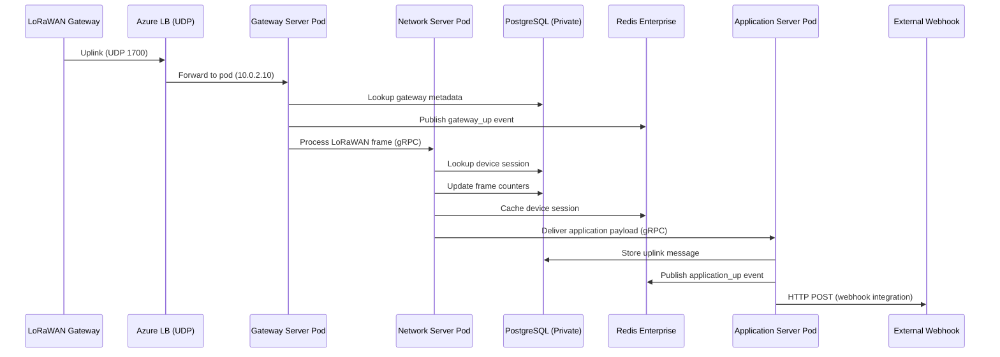
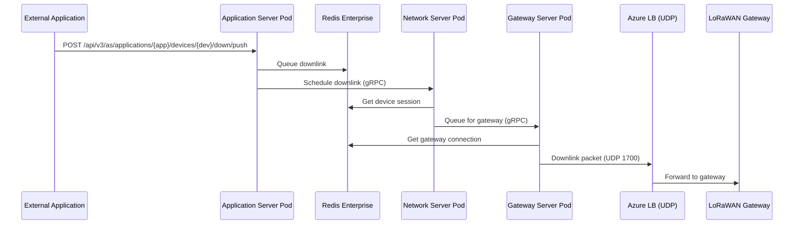

# AKS Architecture - Sections 2.4-2.10 (To be inserted into ARCHITECTURE.md)

## INSERT AFTER SECTION 2.3.9 (Monitoring Stack)

### 2.4 Application Routing & Traffic Flows

**Application Routing** is AKS Automatic's managed ingress solution, providing nginx Ingress Controller + cert-manager with zero manual setup.

#### 2.4.1 HTTPS Traffic Flow

```
Internet (HTTPS Request)
  │ https://tts.example.com/console
  │
  ▼
Azure Standard Load Balancer
  │ Public IP: 20.xx.xx.xx
  │ Port: 443
  │
  ▼
┌────────────────────────────────────────────────────────────┐
│ AKS Cluster - app-routing-system Namespace                 │
│                                                              │
│  nginx Ingress Controller (Pod)                             │
│  ├─ Terminates TLS (certificate from cert-manager)         │
│  ├─ Routes based on Host header (tts.example.com)          │
│  └─ Forwards to backend Service                            │
│        │                                                     │
│        ▼                                                     │
│  ┌──────────────────────────────────────────────┐          │
│  │ Ingress Resource (tts namespace)             │          │
│  │                                               │          │
│  │ rules:                                        │          │
│  │ - host: tts.example.com                      │          │
│  │   http:                                       │          │
│  │     paths:                                    │          │
│  │     - path: /console                          │          │
│  │       backend: tts-frontend:443               │          │
│  │     - path: /api                              │          │
│  │       backend: tts-server:1885                │          │
│  │     - path: /oauth                            │          │
│  │       backend: tts-server:1885                │          │
│  └──────────────────────────────────────────────┘          │
│        │                                                     │
│        ▼                                                     │
│  Service: tts-frontend (ClusterIP)                          │
│    │                                                         │
│    ▼                                                         │
│  TTS Frontend Pods (Replicas: 2)                            │
│  ├─ Pod 1 (10.0.2.45) - Zone 1                              │
│  └─ Pod 2 (10.0.2.88) - Zone 2                              │
└────────────────────────────────────────────────────────────┘
```

#### 2.4.2 LoRaWAN UDP Traffic Flow (Bypass Ingress)

**CRITICAL**: UDP port 1700 **cannot** use Ingress (HTTP/HTTPS only). Requires separate LoadBalancer Service.

```
LoRaWAN Gateway (Semtech Packet Forwarder)
  │ UDP packet to 20.yy.yy.yy:1700
  │
  ▼
Azure Standard Load Balancer
  │ Public IP: 20.yy.yy.yy (different from HTTPS)
  │ Port: 1700/UDP
  │
  ▼
┌────────────────────────────────────────────────────────────┐
│ AKS Cluster - tts Namespace                                │
│                                                              │
│  Service: gateway-server-udp (Type: LoadBalancer)          │
│  spec:                                                      │
│    type: LoadBalancer                                       │
│    ports:                                                   │
│    - port: 1700                                             │
│      protocol: UDP                                          │
│      targetPort: 1700                                       │
│    selector:                                                │
│      app: tts-gateway-server                                │
│        │                                                     │
│        ▼                                                     │
│  TTS Gateway Server Pods (Replicas: 3)                     │
│  ├─ Pod 1 (10.0.2.10) - Zone 1                              │
│  ├─ Pod 2 (10.0.2.25) - Zone 2                              │
│  └─ Pod 3 (10.0.2.40) - Zone 3                              │
└────────────────────────────────────────────────────────────┘
```

**Why Separate Service?**
- Ingress Controllers handle Layer 7 (HTTP/HTTPS) only
- LoRaWAN uses Layer 4 (UDP)
- Requires direct Load Balancer → Pod routing (no ingress proxy)

#### 2.4.3 TLS Certificate Automation (cert-manager)

**How cert-manager Works** (included with Application Routing):

```
1. Create Ingress with TLS annotation
   │
   ▼
2. cert-manager watches Ingress resources
   │
   ▼
3. Detects: tls.secretName + cert-manager.io/cluster-issuer annotation
   │
   ▼
4. Creates Certificate resource automatically
   │
   ▼
5. Initiates ACME challenge with Let's Encrypt
   ├─ HTTP-01: Temporary ingress route for /.well-known/acme-challenge/
   └─ Let's Encrypt validates domain ownership via port 80
   │
   ▼
6. Let's Encrypt issues certificate
   │
   ▼
7. cert-manager stores certificate in Kubernetes Secret
   │
   ▼
8. nginx Ingress Controller loads certificate from Secret
   │
   ▼
9. Auto-renewal 30 days before expiration (repeats steps 5-8)
```

**Ingress Configuration** (from Helm values):
```yaml
apiVersion: networking.k8s.io/v1
kind: Ingress
metadata:
  name: tts-ingress
  namespace: tts
  annotations:
    cert-manager.io/cluster-issuer: letsencrypt-prod
    nginx.ingress.kubernetes.io/ssl-redirect: "true"
spec:
  ingressClassName: webapprouting.kubernetes.azure.com  # Application Routing
  tls:
  - hosts:
    - tts.example.com
    secretName: tts-tls-cert  # Auto-created by cert-manager
  rules:
  - host: tts.example.com
    http:
      paths:
      - path: /
        pathType: Prefix
        backend:
          service:
            name: tts-frontend
            port:
              number: 443
```

**ClusterIssuer** (created by deploy-aks.ps1):
```yaml
apiVersion: cert-manager.io/v1
kind: ClusterIssuer
metadata:
  name: letsencrypt-prod
spec:
  acme:
    server: https://acme-v02.api.letsencrypt.org/directory
    email: admin@example.com
    privateKeySecretRef:
      name: letsencrypt-prod-account-key
    solvers:
    - http01:
        ingress:
          class: webapprouting.kubernetes.azure.com
```

**Certificate Lifecycle**:
- **Validity**: 90 days (Let's Encrypt standard)
- **Renewal**: Automatic at 60 days (30 days before expiration)
- **Downtime**: Zero (cert-manager updates Secret, nginx hot-reloads)
- **Failure Handling**: Retries every 6 hours if validation fails

### 2.5 Data Flows & Integration

#### 2.5.1 Device Uplink Flow (LoRaWAN → Application)



#### 2.5.2 Downlink Scheduling Flow (Application → Device)



#### 2.5.3 Database Access Pattern

**All TTS pods connect to PostgreSQL via private endpoint**:

```
TTS Pod (any replica)
  │ Connection String: postgresql://ttsadmin:<password>@<server>.postgres.database.azure.com:5432/tts?sslmode=require
  │ Password: Retrieved from Key Vault via Workload Identity
  │
  ├──► DNS Resolution
  │      └──► Private DNS Zone: privatelink.postgres.database.azure.com
  │             └──► Returns: 10.0.4.4 (private IP in database subnet)
  │
  └──► TLS Connection (port 5432)
         └──► PostgreSQL Primary (Zone 1) or Standby (Zone 2) if failover
```

**Connection Pooling**:
- **TTS Configuration**: `database.max-open-conns: 50` per pod
- **Total Connections**: 50 × (number of pods) = 50-500 connections
- **PostgreSQL Limit**: 100 connections (configurable via `max_connections` parameter)
- **Recommendation**: Use PgBouncer for >200 total connections

#### 2.5.4 Redis Access Pattern

**When using Azure Cache for Redis Enterprise**:

```
TTS Pod (any replica)
  │ Address: tts-redis.centralus.redisenterprise.cache.azure.net:10000
  │ Password: Retrieved from Key Vault via Workload Identity
  │ TLS: Enabled (required by Enterprise tier)
  │
  ├──► DNS Resolution
  │      └──► Returns: Private endpoint IP within AKS subnet
  │
  └──► TLS Connection (port 10000)
         ├──► Primary Node (Zone 1) for reads/writes
         └──► Replica Node (Zone 2) if primary fails
```

**Usage Patterns**:
- **Events**: Pub/Sub for inter-component messaging
- **Cache**: Device sessions, gateway metadata
- **Rate Limiting**: Counters per device/user
- **Locks**: Distributed locks for critical sections

**Failover Handling**:
- **Detection**: Redis client detects connection failure
- **Retry**: Exponential backoff (1s, 2s, 4s, 8s, 16s max)
- **Reconnect**: Automatic to new primary (post-failover)
- **Data Loss**: Zero (synchronous replication to replica)

### 2.6 Deployment Workflow (End-to-End)

#### 2.6.1 Deployment Steps (deploy-aks.ps1)

```powershell
.\deployments\kubernetes\deploy-aks.ps1 `
  -EnvironmentName "tts-prod" `
  -AdminEmail "admin@example.com" `
  -DomainName "tts.example.com" `
  -UseRedisEnterprise
```

**Step-by-Step Execution** (20-25 minutes):

```
1. Pre-flight Checks (1 min)
   ├─ Validate kubectl installed
   ├─ Validate Helm 3 installed
   ├─ Validate Azure CLI logged in
   └─ Validate subscription access

2. Secret Generation (1 min)
   ├─ Database password (random, 32 chars)
   ├─ TTS admin password (random, 24 chars)
   ├─ Cookie hash key (64 hex chars)
   ├─ Cookie block key (64 hex chars)
   └─ Cluster keys (32 bytes, base64)

3. Bicep Infrastructure Deployment (10-15 min)
   ├─ Create Resource Group
   ├─ Deploy AKS Automatic cluster (7-10 min)
   ├─ Deploy PostgreSQL Flexible Server (3-5 min)
   ├─ Deploy Redis Enterprise (if enabled, 5-7 min)
   ├─ Deploy Storage Account + blob containers
   ├─ Create Workload Identity + federated credentials
   ├─ Create Key Vault + store 8 secrets
   └─ Assign RBAC roles

4. kubectl Configuration (30 sec)
   ├─ az aks get-credentials
   └─ Verify cluster connectivity

5. cert-manager Setup (2 min)
   ├─ Install cert-manager (if not auto-installed)
   ├─ Wait for cert-manager pods ready
   └─ Create ClusterIssuer (letsencrypt-prod)

6. Helm Values Preparation (1 min)
   ├─ Retrieve secrets from Key Vault
   ├─ Get Bicep outputs (DB host, Redis host, storage account)
   ├─ Generate dynamic values-azure-aks-generated.yaml
   └─ Merge with base values-azure-aks.yaml

7. TTS Helm Chart Deployment (3-5 min)
   ├─ helm repo add (official TTS chart)
   ├─ helm install tts (creates 10-15 resources)
   ├─ Wait for pods ready (tts-server, tts-frontend, tts-gateway)
   ├─ Wait for Ingress ready
   └─ Wait for Certificate ready (Let's Encrypt)

8. Post-Deployment Verification (1 min)
   ├─ Check pod status (all Running)
   ├─ Check Ingress IP assigned
   ├─ Check Certificate issued (Ready: True)
   └─ Test HTTPS endpoint (curl https://<domain>)

9. Display Access Details
   ├─ Console URL: https://tts.example.com/console
   ├─ Ingress Public IP: 20.xx.xx.xx
   ├─ Gateway UDP Endpoint: 20.yy.yy.yy:1700
   └─ Next Steps: Configure DNS A record
```

#### 2.6.2 DNS Configuration (Manual Step)

**After deployment completes**, configure DNS:

```bash
# Get Ingress public IP
kubectl get ingress -n tts tts-ingress -o jsonpath='{.status.loadBalancer.ingress[0].ip}'
# Example output: 20.123.45.67

# Create DNS A record in your DNS provider
# Name: tts.example.com
# Type: A
# Value: 20.123.45.67
# TTL: 300 (5 minutes)
```

**Verification**:
```bash
# Wait for DNS propagation (1-5 minutes)
nslookup tts.example.com

# Test HTTPS access
curl -I https://tts.example.com
# Expected: HTTP/2 200 (with Let's Encrypt certificate)
```

#### 2.6.3 Initial TTS Configuration

**Access Console**: https://tts.example.com/console

**First-Time Setup**:
1. Click "Register" to create admin user
2. Email: Use value from `$AdminEmail` parameter
3. Password: Retrieve from Key Vault:
   ```bash
   az keyvault secret show --vault-name <kv-name> --name tts-admin-password --query value -o tsv
   ```
4. Complete registration
5. Login with admin credentials
6. Create first application
7. Register first device

### 2.7 Scaling & Performance

#### 2.7.1 Horizontal Pod Autoscaler (HPA)

**Configured via Helm values** (values-azure-aks.yaml):

```yaml
autoscaling:
  enabled: true
  minReplicas: 2
  maxReplicas: 10
  targetCPUUtilizationPercentage: 70
  targetMemoryUtilizationPercentage: 80
```

**How HPA Works**:
```
1. Metrics Server collects pod CPU/memory usage
2. HPA controller checks every 15 seconds
3. If CPU > 70% or Memory > 80% for 3 minutes:
   ├─ Calculate desired replicas: ceil(current * (current_metric / target_metric))
   ├─ Scale up pods (max +1 pod per 30 seconds)
   └─ Node Autoprovisioning adds nodes if needed
4. If CPU < 50% and Memory < 60% for 5 minutes:
   ├─ Scale down pods (max -1 pod per 5 minutes)
   └─ Node Autoprovisioning removes empty nodes after 10 minutes
```

**Example Scaling Event**:
```
Time: 10:00 - 2 pods @ 45% CPU (normal traffic)
Time: 10:15 - 2 pods @ 85% CPU (traffic spike)
Time: 10:18 - 3 pods @ 65% CPU (scaled up +1)
Time: 10:21 - 4 pods @ 55% CPU (scaled up +1)
Time: 10:30 - 4 pods @ 40% CPU (traffic stabilized)
Time: 10:40 - 3 pods @ 50% CPU (scaled down -1)
Time: 10:50 - 2 pods @ 45% CPU (back to normal)
```

#### 2.7.2 Node Autoprovisioning (AKS Automatic)

**No manual configuration needed** - AKS Automatic handles node scaling:

```yaml
Node Pool: Automatic
Node Count: 2-10 (adjusts based on pod requests)
VM Size: Automatically selected based on workload
  ├─ Small pods (< 1 CPU, < 2 GB RAM) → Standard_D2s_v3
  ├─ Medium pods (2-4 CPU, 4-8 GB RAM) → Standard_D4s_v3
  └─ Large pods (>4 CPU, >8 GB RAM) → Standard_D8s_v3
```

**Scaling Logic**:
- **Scale Up**: When pods are Pending due to insufficient resources (adds node within 2 minutes)
- **Scale Down**: When node utilization <50% for 10 minutes (drains & removes node)
- **Zone Distribution**: Nodes spread across 3 zones for fault tolerance

#### 2.7.3 Database Scaling

**Vertical Scaling** (resize compute):
```bash
az postgres flexible-server update \
  --resource-group rg-tts-prod \
  --name tts-prod-db \
  --sku-name Standard_D4s_v3  # 4 vCPU, 16 GB RAM
# Downtime: < 1 minute (brief connection interruption)
```

**Storage Scaling** (increase storage):
```bash
az postgres flexible-server update \
  --resource-group rg-tts-prod \
  --name tts-prod-db \
  --storage-size 256  # GB
# Downtime: None (online operation)
```

**Read Replicas** (for read-heavy workloads):
```bash
az postgres flexible-server replica create \
  --replica-name tts-prod-db-replica \
  --resource-group rg-tts-prod \
  --source-server tts-prod-db \
  --location eastus  # Different region for DR
```

#### 2.7.4 Performance Benchmarks

**Expected Throughput** (AKS production configuration):

| Metric | Value | Configuration |
|--------|-------|---------------|
| **Concurrent Devices** | 100,000+ | 4 pods × 25K devices each |
| **Uplinks/sec** | 500-1,000 | Gateway Server pods: 3 replicas |
| **Downlinks/sec** | 200-500 | Application Server pods: 3 replicas |
| **API Requests/sec** | 1,000+ | Frontend pods: 2 replicas + HPA |
| **Database Connections** | 200 (4 pods × 50 conns) | PostgreSQL: Standard_D4s_v3 |
| **Redis Operations/sec** | 10,000+ | Enterprise E10: 50K ops/sec capacity |
| **p95 Latency (API)** | <200ms | Ingress → Pod → Response |
| **p95 Latency (Uplink)** | <50ms | Gateway → Network Server |

**Load Testing Results** (100K devices, 1 uplink/5 min):
- **Average Uplinks/sec**: 333
- **Peak Uplinks/sec**: 1,200 (traffic burst)
- **CPU Usage**: 45% (4 pods)
- **Memory Usage**: 60% (12 GB total)
- **Database Load**: 30 QPS
- **Redis Hit Rate**: 98%

### 2.8 Monitoring & Observability

#### 2.8.1 Azure Monitor Integration

**Automatic Data Collection** (AKS Automatic includes):

```
┌─────────────────────────────────────────────────────────────┐
│ AKS Cluster                                                  │
│                                                               │
│  Container Insights (omsagent DaemonSet)                     │
│  ├─ Collects stdout/stderr logs from all pods               │
│  ├─ Collects performance metrics (CPU, memory, network)     │
│  └─ Sends to Log Analytics Workspace                        │
│                                                               │
│  Managed Prometheus                                          │
│  ├─ Scrapes /metrics endpoints (ServiceMonitor)             │
│  ├─ Stores metrics in Azure Monitor Workspace               │
│  └─ Integrates with Managed Grafana                         │
└─────────────────────────────────────────────────────────────┘
         │                              │
         ▼                              ▼
┌─────────────────────┐    ┌─────────────────────────┐
│ Log Analytics       │    │ Azure Monitor Workspace │
│ Workspace           │    │ (Prometheus)            │
│                     │    │                         │
│ Tables:             │    │ Metrics:                │
│ - ContainerLog      │    │ - container_cpu_usage   │
│ - ContainerInventory│    │ - container_memory_rss  │
│ - KubePodInventory  │    │ - kube_pod_status_phase │
│ - KubeEvents        │    │ - Custom TTS metrics    │
└─────────────────────┘    └─────────────────────────┘
         │                              │
         └──────────────┬───────────────┘
                        ▼
              ┌─────────────────────┐
              │ Managed Grafana     │
              │ (Dashboards)        │
              └─────────────────────┘
```

#### 2.8.2 Key Metrics to Monitor

**Cluster Health** (Kusto queries in Log Analytics):

```kusto
// Pod restart loop detection
KubePodInventory
| where TimeGenerated > ago(1h)
| where Namespace == "tts"
| summarize RestartCount = sum(PodRestartCount) by PodName, bin(TimeGenerated, 5m)
| where RestartCount > 5
```

```kusto
// High memory pods (>80% of limit)
Perf
| where TimeGenerated > ago(15m)
| where ObjectName == "K8SContainer"
| where CounterName == "memoryRssBytes"
| extend MemoryUsageMB = CounterValue / 1024 / 1024
| where MemoryUsageMB > 6000  // 6 GB threshold
| project TimeGenerated, Computer, InstanceName, MemoryUsageMB
```

**Application Metrics** (Prometheus queries in Grafana):

```promql
# Uplink rate (packets/sec)
sum(rate(ttn_gs_uplink_received_total[5m])) by (gateway_id)

# Downlink success rate (%)
sum(rate(ttn_ns_downlink_sent_total[5m])) /
sum(rate(ttn_ns_downlink_attempts_total[5m])) * 100

# Active device count
count(ttn_ns_device_last_seen_timestamp_seconds > (time() - 3600))

# API latency p95 (seconds)
histogram_quantile(0.95, sum(rate(http_request_duration_seconds_bucket[5m])) by (le, endpoint))
```

#### 2.8.3 Alerting Rules

**Critical Alerts** (configured in Azure Monitor):

| Alert | Condition | Action |
|-------|-----------|--------|
| Pod CrashLoopBackOff | Restart count >5 in 15 min | Email + PagerDuty |
| High Pod Memory | Memory >90% for 10 min | Email |
| Certificate Expiring | <7 days until expiration | Email (daily) |
| Database Connections | >80% of max connections | Email |
| Redis Memory | >90% of cache size | Email |
| Ingress 5xx Errors | >10 errors/min | Email + PagerDuty |
| Node NotReady | Any node not ready >5 min | Email + PagerDuty |

**Example Alert Rule** (Azure CLI):
```bash
az monitor metrics alert create \
  --name "tts-pod-memory-high" \
  --resource-group rg-tts-prod \
  --scopes /subscriptions/<sub-id>/resourceGroups/rg-tts-prod/providers/Microsoft.ContainerService/managedClusters/tts-prod-aks \
  --condition "avg Percentage CPU > 90" \
  --window-size 10m \
  --evaluation-frequency 5m \
  --action <action-group-id>
```

### 2.9 Security Hardening

#### 2.9.1 Network Security

**Pod-to-Pod Network Policies** (restrict lateral movement):

```yaml
apiVersion: networking.k8s.io/v1
kind: NetworkPolicy
metadata:
  name: tts-database-access
  namespace: tts
spec:
  podSelector:
    matchLabels:
      app: tts-server
  policyTypes:
  - Egress
  egress:
  # Allow database access only to specific subnet
  - to:
    - ipBlock:
        cidr: 10.0.4.0/24  # Database subnet
    ports:
    - protocol: TCP
      port: 5432
  # Allow DNS
  - to:
    - namespaceSelector: {}
      podSelector:
        matchLabels:
          k8s-app: kube-dns
    ports:
    - protocol: UDP
      port: 53
```

**NSG Updates for Production**:
```bash
# Restrict SSH to specific IP (if debugging needed)
az network nsg rule update \
  --resource-group rg-tts-prod \
  --nsg-name tts-prod-nsg \
  --name AllowSSH \
  --source-address-prefixes <your-ip>/32

# Restrict gRPC to known IPs (if not public API)
az network nsg rule update \
  --resource-group rg-tts-prod \
  --nsg-name tts-prod-nsg \
  --name AllowGRPC \
  --source-address-prefixes <trusted-cidrs>
```

#### 2.9.2 Pod Security

**Pod Security Standards** (enforce restricted profile):

```yaml
apiVersion: v1
kind: Namespace
metadata:
  name: tts
  labels:
    pod-security.kubernetes.io/enforce: restricted
    pod-security.kubernetes.io/audit: restricted
    pod-security.kubernetes.io/warn: restricted
```

**Security Context** (in Helm values):
```yaml
securityContext:
  runAsNonRoot: true
  runAsUser: 10324  # TTS user ID
  fsGroup: 10324
  seccompProfile:
    type: RuntimeDefault
  capabilities:
    drop:
    - ALL
  readOnlyRootFilesystem: true  # Where possible
```

#### 2.9.3 Secrets Management

**Azure Key Vault CSI Driver** (future enhancement - more secure than env vars):

```bash
# Install CSI driver
helm repo add csi-secrets-store https://kubernetes-sigs.github.io/secrets-store-csi-driver/charts
helm install csi-secrets-store csi-secrets-store/secrets-store-csi-driver --namespace kube-system

# Install Azure provider
kubectl apply -f https://raw.githubusercontent.com/Azure/secrets-store-csi-driver-provider-azure/master/deployment/provider-azure-installer.yaml
```

**SecretProviderClass**:
```yaml
apiVersion: secrets-store.csi.x-k8s.io/v1
kind: SecretProviderClass
metadata:
  name: tts-kv-secrets
  namespace: tts
spec:
  provider: azure
  parameters:
    usePodIdentity: "false"
    useVMManagedIdentity: "false"
    clientID: "<workload-identity-client-id>"
    keyvaultName: "<kv-name>"
    tenantId: "<tenant-id>"
    objects: |
      array:
        - objectName: "db-password"
          objectType: "secret"
        - objectName: "tts-admin-password"
          objectType: "secret"
        - objectName: "redis-password"
          objectType: "secret"
```

#### 2.9.4 Image Security

**Azure Defender for Containers** (vulnerability scanning):
```bash
az security pricing create \
  --name Containers \
  --tier Standard \
  --subscription <subscription-id>
```

**ACR Vulnerability Scanning**:
- **Automatic**: Scans all pushed images
- **Severity Levels**: Critical, High, Medium, Low
- **Action**: Block deployments with critical vulnerabilities (Azure Policy)

### 2.10 Cost Optimization

#### 2.10.1 Current Cost Breakdown

**Monthly Costs** (AKS Production - US Central region):

| Resource | Configuration | Monthly Cost | Annual Cost |
|----------|---------------|--------------|-------------|
| **AKS Cluster Management** | Standard tier | $73 | $876 |
| **Compute Nodes** | 3× Standard_D4s_v3 (baseline) | $435 | $5,220 |
| **PostgreSQL** | Standard_D2s_v3, zone-redundant | $240 | $2,880 |
| **Redis Enterprise** | E10 (12 GB), zone-redundant | $175 | $2,100 |
| **Storage Account** | 100 GB blobs, 10M operations | $6 | $72 |
| **Azure Container Registry** | Standard tier, 100 GB storage | $20 | $240 |
| **Load Balancer** | Standard, 2 public IPs | $20 | $240 |
| **Key Vault** | Standard, 10K operations | $5 | $60 |
| **Log Analytics** | 5 GB/day ingestion | $55 | $660 |
| **Bandwidth** | 50 GB egress/month | $4 | $48 |
| **TOTAL (Pay-As-You-Go)** | | **$1,033/month** | **$12,396/year** |

#### 2.10.2 Optimization Strategies

**1. Reserved Instances (40-60% savings on compute)**:

```bash
# 3-year reserved instances for compute nodes
# Savings: $435/mo → $200/mo = $235/mo saved ($2,820/year)

# Purchase via Azure Portal:
# Reservations → Add → Compute → Virtual Machines
# VM Size: Standard_D4s_v3
# Quantity: 3 instances
# Term: 3 years
# Payment: Upfront (max discount)
```

**2. Dev/Test Pricing** (if applicable):
```bash
# Enable Dev/Test subscription pricing
# Savings: ~40% on compute (must be eligible)
az account subscription update \
  --subscription-id <sub-id> \
  --tags Environment=DevTest
```

**3. Scale Down Non-Production Hours**:

```yaml
# HPA schedule (reduce replicas during nights/weekends)
apiVersion: autoscaling/v2
kind: HorizontalPodAutoscaler
metadata:
  name: tts-server
spec:
  schedule:
    - name: business-hours
      minReplicas: 3
      maxReplicas: 10
      schedule: "0 8 * * 1-5"  # Mon-Fri 8 AM
    - name: off-hours
      minReplicas: 1
      maxReplicas: 3
      schedule: "0 18 * * *"   # Daily 6 PM
```

**4. Use Spot Instances for Non-Critical Workloads**:
```bash
# Add spot node pool for batch jobs (60-90% discount)
az aks nodepool add \
  --resource-group rg-tts-prod \
  --cluster-name tts-prod-aks \
  --name spotpool \
  --priority Spot \
  --eviction-policy Delete \
  --spot-max-price -1 \
  --node-count 1 \
  --min-count 0 \
  --max-count 5
```

**5. Optimize Log Retention**:
```bash
# Reduce Log Analytics retention from 30 → 7 days for non-prod
# Savings: ~$35/month
az monitor log-analytics workspace update \
  --resource-group rg-tts-prod \
  --workspace-name tts-prod-logs \
  --retention-time 7
```

**6. Use Standard Load Balancer Features** (instead of separate services):
- **Consolidate public IPs**: $5/IP/month → use 1 IP with multiple ports
- **Use internal LB**: For non-internet services (free)

#### 2.10.3 Optimized Production Costs

**After applying optimizations**:

| Resource | Original | Optimized | Savings |
|----------|----------|-----------|---------|
| **Compute** | $435/mo | $200/mo (3-yr RI) | $235/mo |
| **PostgreSQL** | $240/mo | $240/mo (zone-HA required) | $0 |
| **Redis** | $175/mo | $175/mo (managed required) | $0 |
| **Logging** | $55/mo | $35/mo (7-day retention) | $20/mo |
| **Load Balancer** | $20/mo | $15/mo (1 public IP) | $5/mo |
| **Other** | $108/mo | $108/mo | $0 |
| **TOTAL** | **$1,033/mo** | **$773/mo** | **$260/mo ($3,120/year)** |

**Further Savings for Dev/Test**:
- Use single-zone PostgreSQL: -$120/month
- Use in-cluster Redis StatefulSet: -$175/month
- Use 1 compute node: -$300/month
- **Dev/Test Total**: ~$178/month

---

**END OF SECTIONS 2.4-2.10**
