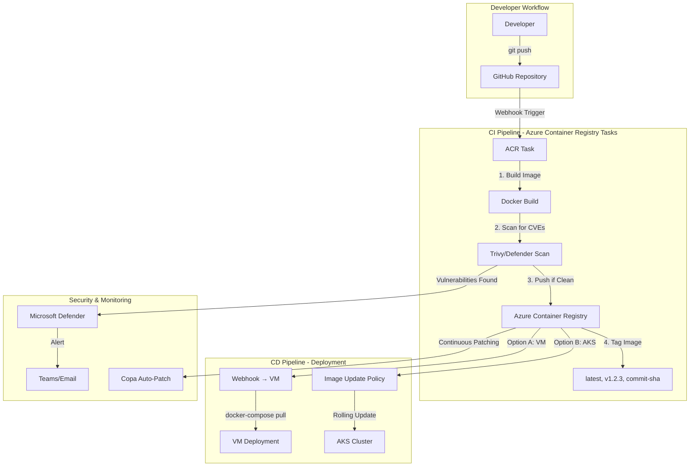

# CI/CD Architecture for The Things Stack on Azure

## Executive Summary

**Current Problem**: The deployment scripts manually deploy applications using kubectl/helm, which doesn't support automated updates or vulnerability scanning.

**Proposed Solution**: Azure-native CI/CD pipeline using Azure Container Registry (ACR) Tasks + GitHub Actions for automated builds, security scanning, and deployments to both VM and AKS environments.

---

## Architecture Overview



---

## Component 1: Azure Container Registry (ACR)

### 1.1 ACR Setup

**Bicep Configuration**:
```bicep
resource acr 'Microsoft.ContainerRegistry/registries@2023-07-01' = {
  name: acrName
  location: location
  sku: {
    name: 'Premium'  // Required for: Tasks, geo-replication, vulnerability scanning
  }
  properties: {
    adminUserEnabled: false  // Use managed identity instead
    publicNetworkAccess: 'Enabled'
    networkRuleBypassOptions: 'AzureServices'
    policies: {
      quarantinePolicy: {
        status: 'enabled'  // Quarantine images with vulnerabilities
      }
      retentionPolicy: {
        days: 30
        status: 'enabled'
      }
      trustPolicy: {
        type: 'Notary'
        status: 'enabled'  // Content trust for signed images
      }
    }
  }
}

// Enable Microsoft Defender for Container Registries
resource defenderPlan 'Microsoft.Security/pricings@2024-01-01' = {
  name: 'ContainerRegistry'
  properties: {
    pricingTier: 'Standard'
  }
}
```

### 1.2 ACR Features Used

| Feature | Purpose | Cost |
|---------|---------|------|
| **ACR Tasks** | Automated builds on git commit | $0.0001/second |
| **Microsoft Defender** | CVE scanning (Trivy-based) | ~$0.29/image |
| **Continuous Patching** | Auto-patch OS vulnerabilities | Included in Tasks |
| **Geo-Replication** | Multi-region availability | ~$50/region/month |
| **Webhooks** | Notify deployments on new images | Free |

---

## Component 2: ACR Tasks (Build Pipeline)

### 2.1 ACR Task Definition

**File**: `.acr/acr-task.yaml`

```yaml
version: v1.1.0
steps:
  # Step 1: Build TTS image
  - id: build-tts
    build: >
      -t {{.Run.Registry}}/thethingsstack:{{.Run.ID}}
      -t {{.Run.Registry}}/thethingsstack:{{.Values.imageTag}}
      -t {{.Run.Registry}}/thethingsstack:latest
      -f Dockerfile
      --build-arg TTS_VERSION={{.Values.ttsVersion}}
      .
    when:
      - 'true'

  # Step 2: Scan for vulnerabilities
  - id: scan-image
    cmd: >
      {{.Run.Registry}}/thethingsstack:{{.Run.ID}}
      trivy image
      --severity HIGH,CRITICAL
      --exit-code 1
      {{.Run.Registry}}/thethingsstack:{{.Run.ID}}
    when:
      - build-tts

  # Step 3: Push only if scan passes
  - id: push-image
    push:
      - {{.Run.Registry}}/thethingsstack:{{.Run.ID}}
      - {{.Run.Registry}}/thethingsstack:{{.Values.imageTag}}
      - {{.Run.Registry}}/thethingsstack:latest
    when:
      - scan-image

  # Step 4: Trigger deployment webhook
  - id: notify-deployment
    cmd: >
      bash -c '
        curl -X POST {{.Values.webhookUrl}}
        -H "Content-Type: application/json"
        -d "{\"image\":\"{{.Run.Registry}}/thethingsstack:{{.Run.ID}}\"}"
      '
    when:
      - push-image
```

### 2.2 Create ACR Task

**PowerShell**:
```powershell
# Create ACR Task for automated builds on GitHub commits
az acr task create `
  --registry $ACR_NAME `
  --name tts-build-task `
  --context https://github.com/blueflightx7/thethingsstack-on-azure.git#main `
  --file .acr/acr-task.yaml `
  --git-access-token $GITHUB_PAT `
  --set ttsVersion=3.30.2 `
  --set imageTag=v3.30.2 `
  --set webhookUrl=https://your-vm-or-aks.azurewebsites.net/deploy

# Enable triggers
az acr task update `
  --name tts-build-task `
  --registry $ACR_NAME `
  --commit-trigger-enabled true `
  --pull-request-trigger-enabled false
```

**What This Does**:
1. **Webhook Created**: GitHub sends webhook to ACR on every commit to `main` branch
2. **Automated Build**: ACR builds Docker image in Azure (no local Docker needed)
3. **Vulnerability Scan**: Trivy scans image, fails build if HIGH/CRITICAL CVEs found
4. **Push to Registry**: Only clean images pushed to ACR
5. **Trigger Deployment**: Webhook sent to VM/AKS to pull new image

---

## Component 3: Vulnerability Scanning

### 3.1 Microsoft Defender for Containers

**Enable via Bicep**:
```bicep
resource defenderContainers 'Microsoft.Security/pricings@2024-01-01' = {
  name: 'Containers'
  properties: {
    pricingTier: 'Standard'
    subPlan: 'P2'  // Includes runtime threat detection
  }
}
```

**Features**:
- **Registry Scanning**: Scans images in ACR every 24 hours
- **Runtime Scanning**: Scans running containers in AKS
- **Continuous Patching**: Auto-patch OS vulnerabilities using Copa
- **Alerts**: Integration with Azure Security Center

### 3.2 ACR Continuous Patching

**Enable Continuous Patching**:
```powershell
# Create patching task (runs daily)
az acr task create `
  --name tts-daily-patch `
  --registry $ACR_NAME `
  --schedule "0 2 * * *" `
  --file .acr/patch-task.yaml
```

**File**: `.acr/patch-task.yaml`
```yaml
version: v1.1.0
steps:
  # Scan all TTS images
  - id: scan-latest
    cmd: >
      trivy image
      --format json
      --output scan-results.json
      {{.Run.Registry}}/thethingsstack:latest
  
  # Patch OS-level vulnerabilities
  - id: patch-image
    cmd: >
      copa patch
      -i {{.Run.Registry}}/thethingsstack:latest
      -o {{.Run.Registry}}/thethingsstack:patched-{{.Run.ID}}
      -r scan-results.json
    when:
      - scan-latest
  
  # Push patched image
  - id: push-patched
    push:
      - {{.Run.Registry}}/thethingsstack:patched-{{.Run.ID}}
      - {{.Run.Registry}}/thethingsstack:latest
    when:
      - patch-image
```

---

## Component 4: VM Deployment (Quick Mode)

### 4.1 VM Update Strategy

**Option A: Watchtower (Automated)**

Add to `docker-compose.yml`:
```yaml
services:
  watchtower:
    image: containrrr/watchtower:latest
    container_name: watchtower
    volumes:
      - /var/run/docker.sock:/var/run/docker.sock
      - /root/.docker/config.json:/config.json:ro  # ACR credentials
    environment:
      - WATCHTOWER_POLL_INTERVAL=300  # Check every 5 minutes
      - WATCHTOWER_CLEANUP=true
      - WATCHTOWER_INCLUDE_RESTARTING=true
      - WATCHTOWER_ROLLING_RESTART=true
    restart: unless-stopped
```

**How It Works**:
1. Watchtower polls ACR every 5 minutes
2. Detects new image with `:latest` tag
3. Pulls new image
4. Gracefully stops old container
5. Starts new container with same config
6. Removes old image

**Option B: Webhook (Manual Control)**

**Webhook Endpoint** (add to cloud-init):
```bash
# Install webhook listener
cat > /usr/local/bin/deploy-webhook.sh << 'EOF'
#!/bin/bash
# Triggered by ACR webhook on new image push

IMAGE_TAG=$1
echo "Deploying new image: ${IMAGE_TAG}"

cd /opt/lorawan-stack

# Update docker-compose.yml with new tag
sed -i "s|image: .*thethingsstack:.*|image: ${IMAGE_TAG}|g" docker-compose.yml

# Pull and restart
docker-compose pull
docker-compose up -d

echo "Deployment complete: ${IMAGE_TAG}"
EOF

chmod +x /usr/local/bin/deploy-webhook.sh

# Install webhook server
npm install -g webhook
webhook --hooks /etc/webhook/hooks.json --verbose
```

**Webhook Configuration** (`/etc/webhook/hooks.json`):
```json
[
  {
    "id": "deploy-tts",
    "execute-command": "/usr/local/bin/deploy-webhook.sh",
    "pass-arguments-to-command": [
      {
        "source": "payload",
        "name": "image"
      }
    ],
    "trigger-rule": {
      "match": {
        "type": "value",
        "value": "push",
        "parameter": {
          "source": "payload",
          "name": "action"
        }
      }
    }
  }
]
```

### 4.2 VM ACR Authentication

**Managed Identity (Preferred)**:
```bicep
// Assign AcrPull role to VM
resource acrPullRole 'Microsoft.Authorization/roleAssignments@2022-04-01' = {
  name: guid(vm.id, acr.id, 'AcrPull')
  scope: acr
  properties: {
    roleDefinitionId: subscriptionResourceId('Microsoft.Authorization/roleDefinitions', '7f951dda-4ed3-4680-a7ca-43fe172d538d')  // AcrPull
    principalId: vm.identity.principalId
    principalType: 'ServicePrincipal'
  }
}
```

**Docker Login via Managed Identity**:
```bash
# Add to cloud-init (runs on boot)
TOKEN=$(curl -H "Metadata:true" "http://169.254.169.254/metadata/identity/oauth2/token?api-version=2018-02-01&resource=https://management.azure.com/" | jq -r '.access_token')

docker login ${ACR_NAME}.azurecr.io \
  --username 00000000-0000-0000-0000-000000000000 \
  --password-stdin <<< "$TOKEN"
```

---

## Component 5: AKS Deployment

### 5.1 AKS Image Update Automation

**Option A: Flux CD (GitOps - Recommended)**

**Install Flux**:
```powershell
# Enable Flux extension on AKS
az k8s-extension create `
  --cluster-name $AKS_CLUSTER `
  --resource-group $RG_NAME `
  --cluster-type managedClusters `
  --extension-type microsoft.flux `
  --name flux
```

**Flux Configuration**:
```yaml
# flux-config.yaml
apiVersion: source.toolkit.fluxcd.io/v1
kind: GitRepository
metadata:
  name: tts-config
  namespace: flux-system
spec:
  interval: 1m
  url: https://github.com/blueflightx7/thethingsstack-on-azure
  ref:
    branch: main
---
apiVersion: image.toolkit.fluxcd.io/v1beta2
kind: ImageRepository
metadata:
  name: tts-image
  namespace: flux-system
spec:
  image: ${ACR_NAME}.azurecr.io/thethingsstack
  interval: 5m
---
apiVersion: image.toolkit.fluxcd.io/v1beta2
kind: ImagePolicy
metadata:
  name: tts-semver
  namespace: flux-system
spec:
  imageRepositoryRef:
    name: tts-image
  policy:
    semver:
      range: '>=3.30.0 <4.0.0'
---
apiVersion: image.toolkit.fluxcd.io/v1beta1
kind: ImageUpdateAutomation
metadata:
  name: tts-automation
  namespace: flux-system
spec:
  interval: 5m
  sourceRef:
    kind: GitRepository
    name: tts-config
  git:
    checkout:
      ref:
        branch: main
    commit:
      author:
        email: flux@thethingsstack.io
        name: Flux Bot
    push:
      branch: main
  update:
    path: ./deployments/kubernetes/manifests
    strategy: Setters
```

**How Flux Works**:
1. Monitors ACR for new images every 5 minutes
2. Detects new image matching semver policy (`>=3.30.0 <4.0.0`)
3. Updates Kubernetes manifest in Git repository
4. Git commit triggers AKS deployment
5. **Blue-Green Deployment**: Kubernetes rolling update (zero downtime)

**Option B: ArgoCD Image Updater**

```yaml
apiVersion: argoproj.io/v1alpha1
kind: Application
metadata:
  name: thethingsstack
  namespace: argocd
  annotations:
    argocd-image-updater.argoproj.io/image-list: tts=${ACR_NAME}.azurecr.io/thethingsstack
    argocd-image-updater.argoproj.io/tts.update-strategy: semver
spec:
  source:
    repoURL: https://github.com/blueflightx7/thethingsstack-on-azure
    path: deployments/kubernetes/manifests
    targetRevision: main
  destination:
    server: https://kubernetes.default.svc
    namespace: tts
  syncPolicy:
    automated:
      prune: true
      selfHeal: true
```

### 5.2 AKS Rolling Update Configuration

**Kubernetes Deployment** (with blue-green strategy):
```yaml
apiVersion: apps/v1
kind: Deployment
metadata:
  name: lorawan-stack
  namespace: tts
spec:
  replicas: 3
  strategy:
    type: RollingUpdate
    rollingUpdate:
      maxSurge: 1        # Max 1 extra pod during update
      maxUnavailable: 0  # Zero downtime
  selector:
    matchLabels:
      app: lorawan-stack
  template:
    metadata:
      labels:
        app: lorawan-stack
    spec:
      containers:
      - name: stack
        image: ${ACR_NAME}.azurecr.io/thethingsstack:latest  # Updated by Flux/ArgoCD
        imagePullPolicy: Always
        readinessProbe:
          httpGet:
            path: /healthz
            port: 1885
          initialDelaySeconds: 30
          periodSeconds: 10
        livenessProbe:
          httpGet:
            path: /healthz
            port: 1885
          initialDelaySeconds: 60
          periodSeconds: 20
```

**How Rolling Update Works**:
1. New image detected by Flux/ArgoCD
2. Kubernetes creates 1 new pod with new image
3. Waits for readiness probe to pass
4. Routes 33% of traffic to new pod
5. Terminates 1 old pod
6. Repeats until all 3 pods updated
7. **Zero downtime** - old pods serve traffic until new pods ready

---

## Component 6: GitHub Actions (Alternative to ACR Tasks)

**File**: `.github/workflows/build-and-deploy.yml`

```yaml
name: Build and Deploy TTS

on:
  push:
    branches: [main]
    paths:
      - 'Dockerfile'
      - 'deployments/**'
  workflow_dispatch:

env:
  ACR_NAME: ${{ secrets.ACR_NAME }}
  IMAGE_NAME: thethingsstack
  
jobs:
  build-and-scan:
    runs-on: ubuntu-latest
    permissions:
      contents: read
      security-events: write
      
    steps:
      - name: Checkout code
        uses: actions/checkout@v4
      
      - name: Azure Login
        uses: azure/login@v2
        with:
          creds: ${{ secrets.AZURE_CREDENTIALS }}
      
      - name: ACR Login
        run: |
          az acr login --name ${{ env.ACR_NAME }}
      
      - name: Build image
        id: build
        run: |
          IMAGE_TAG="${{ github.sha }}"
          docker build \
            -t ${{ env.ACR_NAME }}.azurecr.io/${{ env.IMAGE_NAME }}:${IMAGE_TAG} \
            -t ${{ env.ACR_NAME }}.azurecr.io/${{ env.IMAGE_NAME }}:latest \
            -f Dockerfile \
            --build-arg TTS_VERSION=3.30.2 \
            .
          echo "image_tag=${IMAGE_TAG}" >> $GITHUB_OUTPUT
      
      - name: Scan for vulnerabilities (Trivy)
        uses: aquasecurity/trivy-action@master
        with:
          image-ref: ${{ env.ACR_NAME }}.azurecr.io/${{ env.IMAGE_NAME }}:${{ steps.build.outputs.image_tag }}
          format: 'sarif'
          output: 'trivy-results.sarif'
          severity: 'CRITICAL,HIGH'
          exit-code: 1  # Fail on vulnerabilities
      
      - name: Upload Trivy results to GitHub Security
        uses: github/codeql-action/upload-sarif@v3
        if: always()
        with:
          sarif_file: 'trivy-results.sarif'
      
      - name: Push image to ACR
        if: success()
        run: |
          docker push ${{ env.ACR_NAME }}.azurecr.io/${{ env.IMAGE_NAME }}:${{ steps.build.outputs.image_tag }}
          docker push ${{ env.ACR_NAME }}.azurecr.io/${{ env.IMAGE_NAME }}:latest
      
      - name: Trigger VM deployment webhook
        if: success() && github.ref == 'refs/heads/main'
        run: |
          curl -X POST ${{ secrets.VM_WEBHOOK_URL }} \
            -H "Content-Type: application/json" \
            -d '{"image":"${{ env.ACR_NAME }}.azurecr.io/${{ env.IMAGE_NAME }}:${{ steps.build.outputs.image_tag }}"}'
```

---

## Comparison: ACR Tasks vs GitHub Actions

| Feature | ACR Tasks | GitHub Actions |
|---------|-----------|----------------|
| **Cost** | $0.0001/second (~$0.02/build) | Free (2,000 min/month) |
| **Build Location** | Azure (closer to ACR) | GitHub runners |
| **Defender Integration** | Native | Via Trivy + SARIF upload |
| **Continuous Patching** | Built-in (Copa) | Manual setup required |
| **Complexity** | YAML + az CLI | YAML only |
| **Best For** | Azure-native, patching | GitHub-centric, flexibility |

**Recommendation**: Use **GitHub Actions** for builds + **ACR Continuous Patching** for automated security updates.

---

## Implementation Roadmap

### Phase 1: ACR Setup (Week 1)
- [ ] Add ACR to Bicep templates (VM + AKS)
- [ ] Enable Microsoft Defender for Containers
- [ ] Configure ACR managed identity authentication
- [ ] Test manual docker push/pull from ACR

### Phase 2: Build Pipeline (Week 2)
- [ ] Create `.github/workflows/build-and-deploy.yml`
- [ ] Configure GitHub secrets (ACR credentials)
- [ ] Test automated build on commit
- [ ] Verify vulnerability scanning blocks bad images

### Phase 3: VM Deployment Automation (Week 3)
- [ ] Add Watchtower to docker-compose.yml
- [ ] Configure ACR webhook → VM
- [ ] Test pull latest image on VM
- [ ] Document rollback procedure

### Phase 4: AKS Deployment Automation (Week 4)
- [ ] Install Flux CD on AKS
- [ ] Configure ImageRepository + ImagePolicy
- [ ] Test automated Kubernetes rollout
- [ ] Verify blue-green deployment (zero downtime)

### Phase 5: Continuous Patching (Week 5)
- [ ] Create ACR Task for daily patching
- [ ] Configure Copa auto-patch
- [ ] Test patched image deployment
- [ ] Set up alerts for failed patches

---

## Cost Analysis

### Monthly Costs (Production AKS)

| Component | Cost | Notes |
|-----------|------|-------|
| **ACR Premium** | $165/month | Required for Tasks, geo-replication, scanning |
| **ACR Tasks** | ~$5/month | 250 builds/month @ $0.02/build |
| **Defender for Containers** | ~$30/month | ~100 images scanned @ $0.29/image |
| **Continuous Patching** | Included | Part of ACR Tasks pricing |
| **GitHub Actions** | Free | 2,000 minutes/month on public repo |
| **Total ACR Cost** | **~$200/month** | Replaces manual updates, adds security |

**ROI**:
- **Time Saved**: ~8 hours/month (manual updates, vulnerability checks)
- **Risk Reduction**: Automated patching prevents 0-day exploits
- **Compliance**: Audit trail for all deployments

---

## Security Benefits

1. **Automated CVE Scanning**: Every image scanned before deployment
2. **Continuous Patching**: OS vulnerabilities auto-patched daily
3. **Content Trust**: Only signed images deployed to production
4. **Quarantine Policy**: Vulnerable images blocked from use
5. **Audit Trail**: All builds/deployments logged in Azure Activity Log

---

## Rollback Procedures

### VM Rollback
```bash
# List recent images
docker images ${ACR_NAME}.azurecr.io/thethingsstack

# Rollback to previous tag
docker-compose down
sed -i "s|thethingsstack:.*|thethingsstack:commit-abc123|g" docker-compose.yml
docker-compose up -d
```

### AKS Rollback
```bash
# View rollout history
kubectl rollout history deployment/lorawan-stack -n tts

# Rollback to previous version
kubectl rollout undo deployment/lorawan-stack -n tts

# Rollback to specific revision
kubectl rollout undo deployment/lorawan-stack -n tts --to-revision=3
```

---

## Next Steps

1. **Review This Document**: Discuss ACR Tasks vs GitHub Actions approach
2. **Choose Strategy**: VM (Watchtower vs Webhook), AKS (Flux vs ArgoCD)
3. **Update Bicep Templates**: Add ACR, Defender, webhooks
4. **Create GitHub Workflow**: Build + scan + push pipeline
5. **Test End-to-End**: Commit → Build → Scan → Deploy → Verify

---

## Questions for Decision

1. **Build Pipeline**: ACR Tasks (Azure-native) or GitHub Actions (familiar)?
2. **VM Updates**: Watchtower (automatic) or Webhook (controlled)?
3. **AKS GitOps**: Flux CD (Microsoft-backed) or ArgoCD (CNCF standard)?
4. **Patching**: Daily auto-patch (aggressive) or weekly (conservative)?
5. **Cost**: Is $200/month ACR Premium worth automated security?

Let me know your preferences and I'll implement the chosen architecture!
