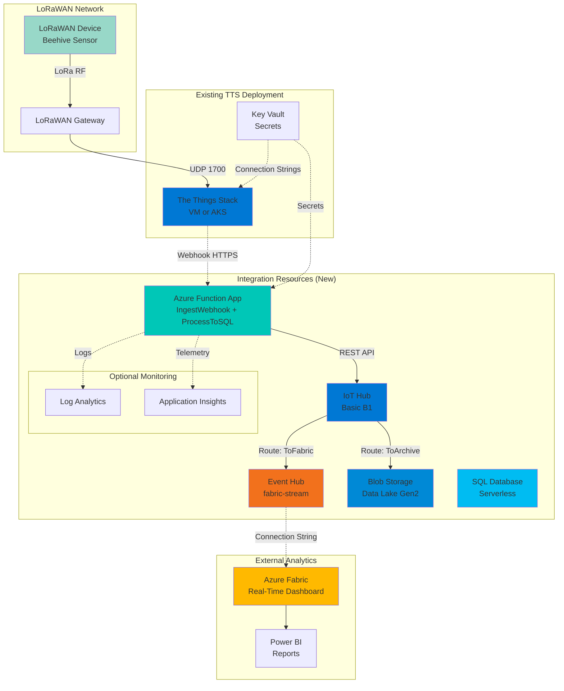
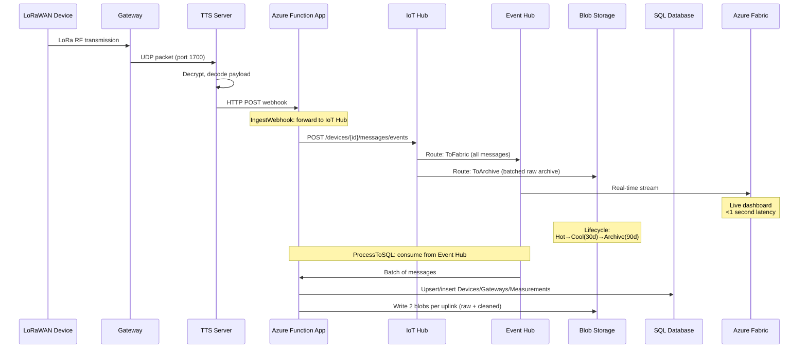

# IoT Hub & Data Intelligence Integration - Deployment Guide

> **Deploy Azure IoT Hub data intelligence infrastructure to bridge TTS telemetry to Azure analytics platform**

_Last updated: December 30, 2025_

---

## 📋 Table of Contents

- [Overview](#overview)
- [Prerequisites](#prerequisites)
- [Architecture](#architecture)
- [Deployment Steps](#deployment-steps)
- [Post-Deployment Configuration](#post-deployment-configuration)
- [Verification](#verification)
- [Troubleshooting](#troubleshooting)
- [Cost Optimization](#cost-optimization)
- [Next Steps](#next-steps)

---

## Overview

The **IoT Hub & Data Intelligence Integration** extends your existing The Things Stack (TTS) deployment with Azure's data intelligence platform. This integration enables:

### ✨ Key Capabilities

- **Real-Time Analytics**: Stream telemetry to Azure Fabric for live dashboards
- **Historical Archival**: Store raw messages in Blob Storage with automatic lifecycle management
- **Structured Query**: Query telemetry data using SQL for business intelligence
- **Enterprise Integration**: Connect to Power BI, Logic Apps, and Azure services
- **Compliance & Audit**: Immutable storage with 90-day cold archive

### 📊 Use Cases

1. **Beehive Monitoring**: Real-time temperature, humidity, weight tracking
2. **IoT Fleet Management**: Device health monitoring and alerting
3. **Environmental Sensing**: Long-term trend analysis and reporting
4. **Predictive Maintenance**: Machine learning on historical data
5. **Regulatory Compliance**: Audit trails and data retention policies

### 🎯 When to Use This Integration

**✅ Use when:**
- You have non-Enterprise TTS (cannot use native integrations)
- You need real-time analytics in Azure Fabric or Power BI
- You want to store telemetry in SQL for business reporting
- You need to integrate TTS data with existing Azure services
- You require long-term data archival for compliance

**❌ Don't use when:**
- You have TTS Enterprise (use native integrations instead)
- You only need basic webhook forwarding (simpler solutions available)
- Your budget doesn't accommodate ~$30-45/month additional cost
- You don't have Azure infrastructure

### 💰 Cost Implications

**Monthly Estimate: $30-45**

| Component | SKU | Cost/Month | Notes |
|-----------|-----|------------|-------|
| IoT Hub | Basic B1 | ~$10 | 400K messages/day limit |
| Event Hub | Basic | ~$11 | 1 million events/month |
| SQL Database | Serverless GP | ~$5-15 | Auto-pause saves 70% |
| Blob Storage | Standard LRS | ~$1-4 | With lifecycle management |
| Azure Functions | Consumption | ~$0-5 | First 1M executions free |
| Monitoring | Optional | ~$3-10 | If creating new resources |

**Cost Optimization Tips:**
- SQL auto-pauses after 1 hour idle (enabled by default)
- Storage lifecycle moves data to Cool (30d) and Archive (90d)
- Event Hub Basic tier sufficient for <1M messages/day
- Function Consumption plan scales to zero when idle

---

## Prerequisites

### Required Azure Resources

Before deploying, you must have:

#### 1. ✅ Existing TTS Deployment

- VM-based (Quick or Advanced) **OR** AKS-based deployment
- Successfully deployed using `deploy.ps1`
- Resource Group accessible to deployment user

#### 2. ✅ Resource Group

- Must already exist
- Will contain both TTS and integration resources
- Region will be auto-detected from Resource Group

#### 3. ✅ Key Vault

- Must exist in the same Resource Group or be accessible
- Deployment user must have **Key Vault Secrets Officer** role
- Used to store:
  - IoT Hub connection strings
  - SQL connection strings
  - Event Hub connection strings
  - Webhook URL

#### 4. ✅ Azure Subscription Permissions

- `Contributor` role on target Resource Group
- Permission to create resources:
  - IoT Hub
  - Azure Functions
  - Event Hubs
  - SQL Database
  - Storage Accounts
- Permission to assign RBAC roles (for Function App Managed Identity)

### Required Tools

#### 1. PowerShell 7+

```powershell
# Check version
$PSVersionTable.PSVersion

# Install PowerShell 7+ if needed
# https://learn.microsoft.com/powershell/scripting/install/installing-powershell
```

#### 2. Azure PowerShell Module

```powershell
# Check if installed
Get-Module -ListAvailable Az

# Install if needed
Install-Module -Name Az -AllowClobber -Scope CurrentUser
```

#### 3. Azure CLI with IoT Extension

```bash
# Install Azure CLI
# https://learn.microsoft.com/cli/azure/install-azure-cli

# Add IoT extension
az extension add --name azure-iot --allow-preview true
```

#### 4. Azure Authentication

```powershell
# PowerShell login
Connect-AzAccount

# CLI login
az login

# Set subscription context
Set-AzContext -SubscriptionId "<your-subscription-id>"
az account set --subscription "<your-subscription-id>"
```

### Optional Tools

- **SQL Server Management Studio (SSMS)** or **Azure Data Studio** - For database operations
- **Azure Storage Explorer** - For browsing archived data
- **Postman** or **curl** - For testing webhook endpoint

---

## Architecture

### High-Level Architecture



### Data Flow Sequence



### Component Responsibilities

#### Blob Storage Layout

The integration uses three containers in the Integration Storage Account:

- `raw-telemetry`: IoT Hub routing archive batches + per-uplink raw blobs written by `ProcessToSQL`
- `processed-data`: per-uplink cleaned/extracted payloads written by `ProcessToSQL`
- `dead-letter`: per-uplink dead-letter envelopes written by `ProcessToSQL` when a message cannot be processed

**Important**: `raw-telemetry` contains two different layouts:

1. **IoT Hub routing archive** (batched):
    - `raw-telemetry/<iothub>/<partition>/<YYYY>/<MM>/<DD>/<HH>/<mm>/...`

2. **Per-uplink archives written by `ProcessToSQL`**:
    - `raw-telemetry/<gateway>/<YYYYMMDD>/<device>/<timestamp>__<device>__<correlation>.raw.json`
    - `processed-data/<gateway>/<YYYYMMDD>/<device>/<timestamp>__<device>__<correlation>.cleaned.json`

3. **Dead-letter envelopes written by `ProcessToSQL`**:
    - `dead-letter/<gateway>/<YYYYMMDD>/<device>/<timestamp>__<device>__<correlation>__<stage>.deadletter.json`

Where:
- `<gateway>` is derived from the message gateway id
- `<device>` is derived from `end_device_ids.device_id` / `dev_eui`
- `<correlation>` is derived from `correlation_ids[0]` when present (fallback is a deterministic hash)

| Component | Purpose | Technology | Scaling |
|-----------|---------|------------|---------|
| **TTS Webhook** | Sends telemetry on device events | HTTP POST | N/A (TTS managed) |
| **Azure Function App** | Ingest + processing (`IngestWebhook`, `ProcessToSQL`) | Azure Functions v4 (C#) | Auto-scale (Consumption) |
| **IoT Hub** | Message ingestion and routing | AMQP/MQTT broker | B1: 400K msgs/day |
| **Event Hub** | Real-time streaming | Kafka-compatible | Basic: 1M events/day |
| **Blob Storage** | Raw message archival | Data Lake Gen2 | Unlimited |
| **SQL Database** | Structured query | SQL Serverless | 0.5-4 vCores on-demand |
| **Application Insights** | Function App monitoring | Telemetry collection | Sampled at scale |

### Network Flow

All traffic flows over HTTPS (TLS 1.2+):

1. **TTS → Function**: Public HTTPS webhook
2. **Function → IoT Hub**: HTTPS REST API with SAS token authentication
3. **IoT Hub → Event Hub**: Internal Azure backbone (AMQP)
4. **IoT Hub → Blob Storage**: Internal Azure backbone
5. **Event Hub → Fabric**: Connection string authentication

**Security Notes:**
- No public endpoints exposed except Function webhook
- All authentication uses SAS tokens / connection strings (stored in Key Vault)
- Secrets stored in Key Vault with RBAC
- Storage and SQL enforce TLS 1.2 minimum

---

## Deployment Steps

### Step 1: Prepare Environment

#### 1.1 Verify Prerequisites

Run this checklist in PowerShell:

```powershell
# Check PowerShell version (must be 7+)
$PSVersionTable.PSVersion

# Check Azure PowerShell module
Get-Module -ListAvailable Az | Select-Object Name, Version

# Check Azure CLI and IoT extension
az version
az extension show --name azure-iot

# Check authentication
Get-AzContext
az account show

# Verify Resource Group exists
$rgName = "your-tts-rg"
Get-AzResourceGroup -Name $rgName

# Verify Key Vault exists and you have access
$kvName = "your-keyvault"
Get-AzKeyVault -VaultName $kvName
```

#### 1.2 Navigate to Repository

```powershell
cd C:\path\to\thethingsstack-on-azure
```

### Step 2: Run Deployment

#### 2.1 Interactive Deployment (Recommended)

```powershell
.\deploy.ps1
```

**Menu Navigation:**
1. Select **[6] Add IoT Hub & Data Intelligence**
2. Enter Resource Group name (where your TTS deployment exists)
3. Enter Key Vault name
4. Script auto-detects region from Resource Group
5. Choose monitoring option (see Step 2.3)

#### 2.2 Non-Interactive Deployment

```powershell
.\deploy.ps1 -Mode integration
```

You'll be prompted for:
- Resource Group name
- Key Vault name

Region is auto-detected.

#### 2.3 Monitoring Resource Selection

The deployment detects existing Log Analytics and Application Insights:

**Scenario 1: Existing Resources Found**

```
✓ Found existing Log Analytics: tts-law-abc123
✓ Found existing App Insights: tts-ai-abc123

Found existing monitoring resources. [R]euse, [C]reate New, or [S]kip monitoring? (Default: Reuse)
```

**Decision Guide:**

| Choice | When to Use | Impact |
|--------|-------------|--------|
| **Reuse** (Default) | Same team, shared cost center | Function sends telemetry to existing resources |
| **Create New** | Separate billing, different team | New monitoring stack (~$3-10/month) |
| **Skip** | Dev/test only, cost-sensitive | No monitoring (NOT recommended for production) |

**Scenario 2: No Existing Resources**

```
No existing monitoring resources found. [C]reate New or [S]kip monitoring? (Default: Create)
```

**Recommendation:** Always **Create** for production workloads.

### Step 3: Monitor Deployment

Deployment takes approximately **5-10 minutes**.

**Progress Stages:**

```
1. [00:00-00:30] Generating SQL password
2. [00:30-01:00] Detecting monitoring resources
3. [01:00-01:30] Deploying Bicep template
4. [01:30-06:00] Provisioning Azure resources
   - IoT Hub (2-3 minutes)
   - SQL Database (1-2 minutes)
   - Event Hub (30 seconds)
   - Storage Account (30 seconds)
   - Function App (1 minute)
   - Monitoring (if creating: 1 minute)
5. [06:00-07:00] Creating IoT Hub device identity
6. [07:00-08:00] Configuring Function App
7. [08:00-09:00] Deploying Function code
8. [09:00-10:00] Initializing SQL schema
9. [10:00-10:30] Generating configuration helper
```

**Watch for:**
- ✅ Green "Deployment completed successfully" message
- ⚠️ Yellow warnings (non-fatal, review if present)
- ❌ Red errors (fatal, see Troubleshooting section)

### Step 4: Capture Outputs

After successful deployment, you'll see:

```
✓ Infrastructure Deployed Successfully

Webhook URL: https://tts-int-func-abc123.azurewebsites.net/api/IngestWebhook
Event Hub Connection String: Endpoint=sb://tts-int-evhns-abc123.servicebus.windows.net/...
SQL Server: tts-int-sql-abc123.database.windows.net
Database: tts-data
IoT Hub: tts-int-iot-abc123.azure-devices.net
Function App: tts-int-func-abc123

Configuration helper generated: deployments/integration/configure-tts-webhook.sh
```

**Save these values** - you'll need them for post-deployment configuration.

---

## Updating Code Only (No Infrastructure)

If you need to update just the ProcessToSQL function code (e.g., fix a bug, add new fields), use the unified update script instead of re-running the full deployment:

```powershell
# Interactive menu
.\deployments\update.ps1

# Or direct command for Function only
.\deployments\update.ps1 -Component Function
```

This is faster (~30 seconds) than a full deployment and only updates the code, not infrastructure or app settings.

See [Update Guide](update-guide.md) for all update options including SQL schema updates.

---

## Post-Deployment Configuration

### Step 1: Configure TTS Webhook

#### 1.1 Locate Configuration Helper

The deployment generates a helper script:

```bash
deployments/integration/configure-tts-webhook.sh
```

#### 1.2 Update Script with TTS API Key

Edit the generated file:

```bash
#!/bin/bash
# Run this on your TTS VM to configure the Webhook

WEBHOOK_URL="https://tts-int-func-abc123.azurewebsites.net/api/IngestWebhook"
API_KEY="<YOUR_TTS_API_KEY>"  # ← Change this
APP_ID="<YOUR_APP_ID>"         # ← Change this

echo "Configuring Webhook for $APP_ID..."

curl -X POST \
  "https://your-tts-domain.com/api/v3/as/applications/$APP_ID/webhooks" \
  -H "Authorization: Bearer $API_KEY" \
  -H "Content-Type: application/json" \
  -d '{
    "webhook": {
      "webhook_id": "azure-integration",
      "format": "json",
      "base_url": "'"$WEBHOOK_URL"'",
      "headers": {
                "Content-Type": "application/json",
                "x-functions-key": "'"$FUNCTION_KEY"'"
      },
      "uplink_message": {
        "path": ""
      },
      "join_accept": {
        "path": ""
      },
      "location_solved": {
        "path": ""
      }
    }
  }'
```

**How to get TTS API Key:**

1. SSH to your TTS VM:
   ```bash
   ssh azureuser@your-tts-vm-ip
   ```

2. Get API key for admin user:
   ```bash
   docker exec lorawan-stack_stack_1 ttn-lw-cli users api-keys list admin
   ```

3. Or create new API key with webhook permissions:
   ```bash
   docker exec lorawan-stack_stack_1 ttn-lw-cli users api-keys create \
     --user-id admin \
     --name azure-integration \
     --right-application-all
   ```

#### 1.3 Run Configuration Script

Before running, set the `FUNCTION_KEY` used for the `x-functions-key` header. The deployment stores it in Key Vault as `integration-webhook-functions-key`.

From your deployment machine (where you ran `deploy.ps1`), retrieve it with:

```bash
az keyvault secret show --vault-name <your-keyvault-name> --name integration-webhook-functions-key --query value -o tsv
```

Execute on your TTS VM:

```bash
chmod +x deployments/integration/configure-tts-webhook.sh
./deployments/integration/configure-tts-webhook.sh
```

**Expected Output:**

```json
{
  "ids": {
    "application_ids": {
      "application_id": "your-app-id"
    },
    "webhook_id": "azure-integration"
  },
  "created_at": "2025-12-03T12:00:00.000Z",
  "updated_at": "2025-12-03T12:00:00.000Z",
  "base_url": "https://tts-int-func-abc123.azurewebsites.net/api/IngestWebhook",
  "format": "json",
  ...
}
```

#### 1.4 Verify Webhook in TTS Console

1. Open TTS Console: `https://your-tts-domain.com/console`
2. Navigate to **Applications** → **Your Application** → **Integrations** → **Webhooks**
3. Verify **azure-integration** webhook is listed with status **Active**

### Step 2: Test Data Flow

#### 2.1 Trigger Test Message

Send test uplink from a device or use TTS Console:

1. In TTS Console: **Applications** → **End Devices** → **Your Device**
2. Click **Messaging** tab
3. Click **Simulate uplink** (if available) or wait for real device transmission

#### 2.2 Verify Function Execution

Check Function App logs:

```powershell
# Via PowerShell
$functionAppName = "tts-int-func-abc123"
$rgName = "your-tts-rg"

az functionapp logs tail --name $functionAppName --resource-group $rgName
```

**Expected Log Output:**

```
2025-12-03T12:05:00.123 [Information] Executing 'IngestWebhook' (Reason='This function was programmatically called via the host APIs.', Id=abc-123)
2025-12-03T12:05:00.234 [Information] Received webhook from device: my-beehive-sensor
2025-12-03T12:05:00.345 [Information] Successfully sent to IoT Hub
2025-12-03T12:05:00.456 [Information] Executed 'IngestWebhook' (Succeeded, Id=abc-123, Duration=333ms)
```

#### 2.3 Verify IoT Hub Reception

Check IoT Hub metrics:

```powershell
# Get message count
az iot hub monitor-events --hub-name tts-int-iot-abc123 --output table
```

Or in Azure Portal:
1. Navigate to **IoT Hub** → **Metrics**
2. Add metric: **Telemetry messages sent**
3. Verify count increases after test message

### Step 3: Connect to Azure Fabric (Optional)

See [Azure Fabric Connection Guide](../operate/fabric-connection-guide.md) for detailed steps.

**Quick Start:**

1. In Azure Portal, navigate to **Event Hubs** → **tts-int-evhns-abc123** → **fabric-stream**
2. Copy **Connection string–primary key**
3. In Azure Fabric workspace:
   - Create new **Eventstream**
   - Add source: **Azure Event Hubs**
   - Paste connection string
   - Configure destinations (KQL Database, Real-Time Dashboard)

### Step 4: Query SQL Database (Optional)

#### 4.1 Connect to SQL Database

Using Azure Data Studio or SSMS:

**Connection Details:**
- Server: `tts-int-sql-abc123.database.windows.net`
- Database: `tts-data`
- Authentication: **Azure Active Directory - Universal with MFA**

#### 4.2 Run Sample Queries

```sql
-- Check devices table
SELECT * FROM Devices;

-- Check recent measurements
SELECT TOP 10 
    d.DevEUI,
    m.Timestamp,
    m.Temperature_Inner,
    m.Temperature_Outer,
    m.Weight_KG
FROM Measurements m
JOIN Devices d ON m.DeviceID = d.DeviceID
ORDER BY m.Timestamp DESC;

-- Get latest reading per device
WITH LatestMeasurements AS (
    SELECT 
        DeviceID,
        Timestamp,
        Temperature_Inner,
        ROW_NUMBER() OVER (PARTITION BY DeviceID ORDER BY Timestamp DESC) as rn
    FROM Measurements
)
SELECT 
    d.DevEUI,
    d.Name,
    lm.Timestamp as LastSeen,
    lm.Temperature_Inner
FROM LatestMeasurements lm
JOIN Devices d ON lm.DeviceID = d.DeviceID
WHERE lm.rn = 1;
```

---

## Verification

### Deployment Success Checklist

- [ ] All Azure resources created (IoT Hub, Event Hub, SQL, Storage, Functions)
- [ ] Function App deployed with code (verify in Azure Portal)
- [ ] IoT Hub device identity "TTS-Bridge" created
- [ ] SQL schema applied (tables: Devices, Hives, Measurements)
- [ ] Key Vault secrets stored (4 secrets: iot, sql, eventhub, webhook)
- [ ] TTS webhook configured and active
- [ ] Test message sent and received in IoT Hub
- [ ] Function App logs show successful execution
- [ ] (Optional) Event Hub streaming to Azure Fabric
- [ ] (Optional) SQL database contains test data

### Health Check Script

Save as `check-integration-health.ps1`:

```powershell
param(
    [string]$ResourceGroupName = "your-tts-rg",
    [string]$Prefix = "tts-int"
)

Write-Host "Checking Integration Health..." -ForegroundColor Cyan

# Get resource name pattern
$rgInfo = Get-AzResourceGroup -Name $ResourceGroupName
$uniqueSuffix = ($rgInfo.ResourceId -split '/')[-1]

# Check IoT Hub
$iotHub = Get-AzIotHub -ResourceGroupName $ResourceGroupName | Where-Object { $_.Name -like "$Prefix*" }
if ($iotHub) {
    Write-Host "✓ IoT Hub: $($iotHub.Name)" -ForegroundColor Green
} else {
    Write-Host "✗ IoT Hub: NOT FOUND" -ForegroundColor Red
}

# Check Function App
$functionApp = Get-AzFunctionApp -ResourceGroupName $ResourceGroupName | Where-Object { $_.Name -like "$Prefix*" }
if ($functionApp) {
    Write-Host "✓ Function App: $($functionApp.Name)" -ForegroundColor Green
    
    # Check if code deployed
    $appSettings = $functionApp.ApplicationSettings
    if ($appSettings.BridgeConnectionString) {
        Write-Host "  ✓ BridgeConnectionString configured" -ForegroundColor Green
    } else {
        Write-Host "  ✗ BridgeConnectionString missing" -ForegroundColor Yellow
    }
} else {
    Write-Host "✗ Function App: NOT FOUND" -ForegroundColor Red
}

# Check SQL Database
$sqlServer = Get-AzSqlServer -ResourceGroupName $ResourceGroupName | Where-Object { $_.ServerName -like "$Prefix*" }
if ($sqlServer) {
    Write-Host "✓ SQL Server: $($sqlServer.ServerName)" -ForegroundColor Green
    
    $db = Get-AzSqlDatabase -ResourceGroupName $ResourceGroupName -ServerName $sqlServer.ServerName | Where-Object { $_.DatabaseName -eq "tts-data" }
    if ($db) {
        Write-Host "  ✓ Database: $($db.DatabaseName)" -ForegroundColor Green
    }
} else {
    Write-Host "✗ SQL Server: NOT FOUND" -ForegroundColor Red
}

# Check Event Hub
$ehNamespace = Get-AzEventHubNamespace -ResourceGroupName $ResourceGroupName | Where-Object { $_.Name -like "$Prefix*" }
if ($ehNamespace) {
    Write-Host "✓ Event Hub Namespace: $($ehNamespace.Name)" -ForegroundColor Green
    
    $eh = Get-AzEventHub -ResourceGroupName $ResourceGroupName -NamespaceName $ehNamespace.Name | Where-Object { $_.Name -eq "fabric-stream" }
    if ($eh) {
        Write-Host "  ✓ Event Hub: $($eh.Name)" -ForegroundColor Green
    }
} else {
    Write-Host "✗ Event Hub: NOT FOUND" -ForegroundColor Red
}

# Check Storage Account
$storage = Get-AzStorageAccount -ResourceGroupName $ResourceGroupName | Where-Object { $_.StorageAccountName -like "$Prefix*" }
if ($storage) {
    Write-Host "✓ Storage Account: $($storage.StorageAccountName)" -ForegroundColor Green
} else {
    Write-Host "✗ Storage Account: NOT FOUND" -ForegroundColor Red
}

Write-Host "`nHealth check complete!" -ForegroundColor Cyan
```

Run the health check:

```powershell
.\check-integration-health.ps1 -ResourceGroupName "your-tts-rg"
```

---

## Troubleshooting

### Deployment Failures

#### Issue 1: "Storage account name cannot contain hyphens"

**Symptoms:**
```
Deployment failed: Storage account name 'tts-int-st-abc123' is invalid
```

**Cause:** Prefix parameter contains hyphens, which are not allowed in storage account names.

**Solution:** This should be handled automatically by `replace(prefix, '-', '')` in Bicep. If you still see this error:

```powershell
# Manual fix: Re-deploy with alphanumeric prefix only
.\deploy.ps1 -Mode integration
# When prompted for prefix (if customizing), use: ttsint (no hyphens)
```

#### Issue 2: "Azure IoT CLI extension not found"

**Symptoms:**
```
'az iot hub device-identity' is not a valid command
```

**Cause:** Azure IoT extension not installed.

**Solution:**

```bash
az extension add --name azure-iot --allow-preview true
```

#### Issue 3: "Invoke-Sqlcmd not found"

**Symptoms:**
```
WARNING: Invoke-Sqlcmd not found. Please run 'schema.sql' manually on the database.
```

**Cause:** SQL Server PowerShell module not installed (optional dependency).

**Solution:**

**Option A: Install SQL Server module**
```powershell
Install-Module -Name SqlServer -AllowClobber
```

**Option B: Run schema manually**
```powershell
# Using Azure Data Studio or SSMS
# 1. Connect to: tts-int-sql-abc123.database.windows.net
# 2. Open: deployments/integration/sql/schema.sql
# 3. Execute against database: tts-data
```

#### Issue 4: "KeyVault access denied"

**Symptoms:**
```
ERROR: The user, group or application does not have secrets set permission on key vault 'your-kv'
```

**Cause:** Insufficient RBAC permissions on Key Vault.

**Solution:**

```powershell
# Get your object ID
$userObjectId = (Get-AzADUser -UserPrincipalName (Get-AzContext).Account.Id).Id

# Assign Key Vault Secrets Officer role
New-AzRoleAssignment `
    -ObjectId $userObjectId `
    -RoleDefinitionName "Key Vault Secrets Officer" `
    -Scope "/subscriptions/<sub-id>/resourceGroups/<rg>/providers/Microsoft.KeyVault/vaults/<kv-name>"

# Wait 30 seconds for propagation
Start-Sleep -Seconds 30

# Retry deployment
.\deploy.ps1 -Mode integration
```

### Post-Deployment Issues

#### Issue 5: Webhook not receiving data

**Symptoms:**
- TTS shows webhook configured but no Function App logs
- Function App "Invocations" metric shows 0

**Diagnosis Steps:**

1. **Verify webhook configuration:**
   ```bash
   # On TTS VM
   docker exec lorawan-stack_stack_1 ttn-lw-cli applications webhooks list <app-id>
   ```

2. **Test webhook endpoint directly:**
   ```powershell
   $webhookUrl = "https://tts-int-func-abc123.azurewebsites.net/api/IngestWebhook"
   $testPayload = @{
       end_device_ids = @{
           device_id = "test-device"
       }
       uplink_message = @{
           decoded_payload = @{
               temperature = 25.5
           }
       }
   } | ConvertTo-Json
   
   Invoke-RestMethod -Uri $webhookUrl -Method Post -Body $testPayload -ContentType "application/json"
   ```

3. **Check Function App status:**
   ```powershell
   Get-AzFunctionApp -ResourceGroupName $rgName -Name $functionAppName | Select-Object State
   ```

**Solutions:**

- **Webhook URL incorrect**: Verify URL matches Function App output
- **TTS API key invalid**: Regenerate API key and reconfigure webhook
- **Function App stopped**: Start Function App in Azure Portal
- **Network connectivity**: Check if TTS VM can reach public internet (outbound HTTPS)

#### Issue 6: IoT Hub connection failures

**Symptoms:**
```
[Error] Failed to send to IoT Hub: Unauthorized
```

**Diagnosis:**

```powershell
# Check device connection string
$functionAppName = "tts-int-func-abc123"
$connString = az functionapp config appsettings list `
    --name $functionAppName `
    --resource-group $rgName `
    --query "[?name=='BridgeConnectionString'].value" -o tsv

Write-Host "Connection String: $connString"
```

**Solutions:**

- **Connection string missing**: Re-run device identity creation
  ```bash
  az iot hub device-identity create --device-id TTS-Bridge --hub-name tts-int-iot-abc123
  $connString = az iot hub device-identity connection-string show --device-id TTS-Bridge --hub-name tts-int-iot-abc123 --query connectionString -o tsv
  az functionapp config appsettings set --name $functionAppName --resource-group $rgName --settings "BridgeConnectionString=$connString"
  ```

- **SAS token expired**: Function generates tokens dynamically, check for clock skew
- **IoT Hub throttling**: Upgrade to higher SKU (B1 → S1) if exceeding 400K messages/day

#### Issue 7: SQL Database auto-paused

**Symptoms:**
- Queries fail with "database is currently paused"
- Connection timeout on first query

**Cause:** SQL Serverless auto-pauses after 1 hour of inactivity (by design).

**Expected Behavior:**
- First connection after pause takes ~30-60 seconds to resume
- Subsequent queries execute normally
- Auto-pause saves ~70% on compute costs

**Solutions:**

- **Wait for resume**: Retry query after 60 seconds
- **Disable auto-pause** (increases cost):
  ```powershell
  Set-AzSqlDatabase `
      -ResourceGroupName $rgName `
      -ServerName $sqlServer `
      -DatabaseName "tts-data" `
      -AutoPauseDelayInMinutes -1
  ```
- **Use Always-on tier** (not Serverless): Requires re-deployment with different SKU

#### Issue 8: Event Hub not streaming to Fabric

**Symptoms:**
- Event Hub metrics show messages received
- Fabric Eventstream shows "No data"

**Diagnosis:**

1. **Check Event Hub connection string:**
   ```powershell
   # In Azure Portal: Event Hubs → tts-int-evhns-abc123 → fabric-stream → Shared access policies
   # Verify "IntegrationSharedAccessKey" exists with Send, Listen permissions
   ```

2. **Verify IoT Hub routing:**
   ```powershell
   az iot hub route list --hub-name tts-int-iot-abc123 --output table
   # Ensure "ToFabric" route is enabled
   ```

**Solutions:**

- **Connection string incorrect**: Re-copy from Event Hub, update in Fabric
- **Consumer group conflict**: Create dedicated consumer group in Event Hub for Fabric
- **Routing rule disabled**: Enable "ToFabric" route in IoT Hub
- **Fabric workspace permissions**: Ensure Fabric workspace can access Event Hub (check NSG/firewall rules)

---

## Cost Optimization

### Reduce SQL Costs (70% Savings)

SQL Serverless auto-pause is enabled by default. Verify configuration:

```powershell
Get-AzSqlDatabase -ResourceGroupName $rgName -ServerName $sqlServer -DatabaseName "tts-data" | Select-Object AutoPauseDelayInMinutes

# Expected: 60 (auto-pause after 1 hour idle)
```

**Additional Optimization:**

```powershell
# Increase auto-pause delay if frequent access (reduces resume overhead)
Set-AzSqlDatabase `
    -ResourceGroupName $rgName `
    -ServerName $sqlServer `
    -DatabaseName "tts-data" `
    -AutoPauseDelayInMinutes 120  # 2 hours

# Reduce max vCores if low query volume
Set-AzSqlDatabase `
    -ResourceGroupName $rgName `
    -ServerName $sqlServer `
    -DatabaseName "tts-data" `
    -ComputeModel Serverless `
    -Edition GeneralPurpose `
    -ComputeGeneration Gen5 `
    -VCore 2  # Default is 4, reduce to 2 or 1
```

### Optimize Storage Lifecycle

Default lifecycle policy moves data to Cool/Archive automatically. Customize if needed:

```powershell
# Get current policy
az storage account management-policy show `
    --account-name $storageAccountName `
    --resource-group $rgName

# Update to more aggressive archival (e.g., Archive after 60 days)
# Edit: deployments/integration/integration.bicep lines 65-92
# Re-deploy after changes
```

### Monitor Function Costs

Function App on Consumption plan is usually <$5/month. Monitor execution count:

```powershell
# Via Azure Monitor
az monitor metrics list `
    --resource /subscriptions/<sub-id>/resourceGroups/$rgName/providers/Microsoft.Web/sites/$functionAppName `
    --metric FunctionExecutionCount `
    --start-time (Get-Date).AddDays(-7) `
    --end-time (Get-Date) `
    --interval PT1H `
    --output table
```

**If exceeding 1M executions/month** (unlikely for typical TTS deployments):
- Consider Premium plan with reserved capacity
- Implement batching in TTS webhook (group multiple messages)

### Right-Size IoT Hub

IoT Hub B1 supports 400K messages/day. Monitor usage:

```powershell
az monitor metrics list `
    --resource /subscriptions/<sub-id>/resourceGroups/$rgName/providers/Microsoft.Devices/IotHubs/$iotHubName `
    --metric d2c.telemetry.ingress.success `
    --start-time (Get-Date).AddDays(-30) `
    --end-time (Get-Date) `
    --aggregation Total `
    --output table
```

**Optimization:**
- **<100K msgs/day**: B1 is appropriate
- **100-400K msgs/day**: B1 is cost-optimal
- **>400K msgs/day**: Upgrade to S1 (8M messages/day, ~$25/month)

---

## Next Steps

### Immediate Next Steps

1. ✅ **Configure Real-Time Dashboard**: See [Azure Fabric Connection Guide](../operate/fabric-connection-guide.md)
2. ✅ **Set Up Alerts**: Configure Function failures, IoT Hub throttling alerts
3. ✅ **Review SQL Schema**: Customize tables for your use case (see [SQL Database Guide](../operate/sql-database-guide.md))
4. ✅ **Test Data Flow**: Send 100 messages, verify in all destinations
5. ✅ **Document Webhook URL**: Store in team documentation/runbook

### Advanced Configuration

1. **Tune de-duplication**: Validate `CorrelationId` extraction matches your upstream (TTS / gateways) correlation ID conventions
2. **Implement Data Retention**: Configure Logic App to archive old SQL data to Blob Storage and truncate
3. **Add Custom IoT Hub Routes**: Route specific message types to different Event Hubs
4. **Enable IoT Hub Device Provisioning**: Automate device identity creation for new TTS devices
5. **Integrate with Power BI**: Create Power BI reports from SQL database

### Operational Readiness

1. **Set Up Monitoring Alerts**: See [Integration Operations Guide](../operate/integration-operations.md)
2. **Create Runbook**: Document webhook reconfiguration, SQL maintenance procedures
3. **Plan Disaster Recovery**: Document backup/restore procedures for SQL database
4. **Schedule Cost Review**: Monthly review of actual costs vs. estimates
5. **Train Team**: Ensure team understands architecture and troubleshooting steps

---

## References

### Documentation

- **[Integration Architecture](../reference/integration-architecture.md)** - Technical deep-dive
- **[Integration Operations Guide](../operate/integration-operations.md)** - Day-2 operations
- **[Azure Fabric Connection Guide](../operate/fabric-connection-guide.md)** - Real-time analytics setup
- **[SQL Database Guide](../operate/sql-database-guide.md)** - Database operations
- **[Function App Reference](../reference/function-app-reference.md)** - Azure Functions details

### Azure Resources

- [Azure IoT Hub Documentation](https://learn.microsoft.com/azure/iot-hub/)
- [Azure Event Hubs Documentation](https://learn.microsoft.com/azure/event-hubs/)
- [Azure SQL Database Serverless](https://learn.microsoft.com/azure/azure-sql/database/serverless-tier-overview)
- [Azure Functions Best Practices](https://learn.microsoft.com/azure/azure-functions/functions-best-practices)
- [Azure Storage Lifecycle Management](https://learn.microsoft.com/azure/storage/blobs/lifecycle-management-overview)

### TTS Documentation

- [The Things Stack Webhooks](https://www.thethingsindustries.com/docs/integrations/webhooks/)
- [TTS API Reference](https://www.thethingsindustries.com/docs/reference/api/)

---

**Need Help?**

- 🐛 **Report Issues**: [GitHub Issues](https://github.com/blueflightx7/thethingsstack-on-azure/issues)
- 💬 **Discuss**: [GitHub Discussions](https://github.com/blueflightx7/thethingsstack-on-azure/discussions)
- 📖 **Main Documentation**: [README.md](../../README.md)
